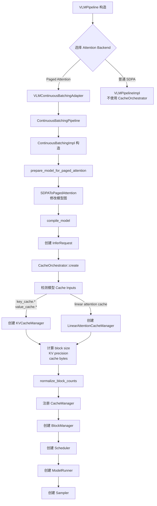
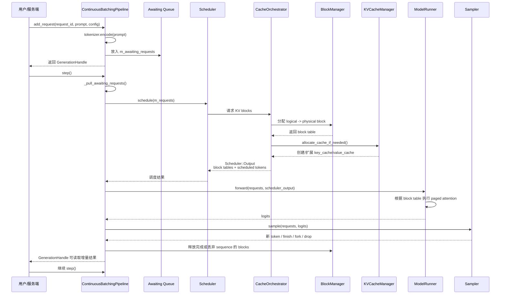
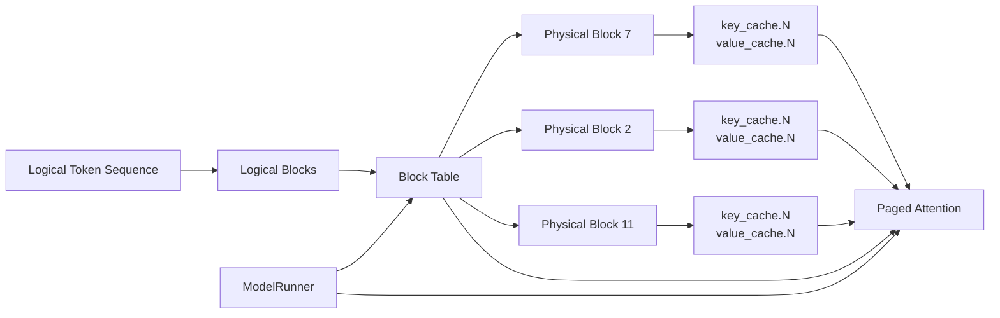

# OpenVINO GenAI Paged KV Cache 调用链

## 1. 初始化调用链



## 2. OpenVINO 入口边界

```mermaid
flowchart TD
    A[openvino.genai<br/>ContinuousBatchingImpl]
    A --> B[ov::Core::compile_model<br/>singleton_core().compile_model]
    B --> C[ov::CompiledModel]
    C --> D[ov::CompiledModel::create_infer_request]
    D --> E[ov::InferRequest]

    E --> F[CacheOrchestrator::create]
    F --> G[KVCacheManager<br/>发现 key_cache.* / value_cache.*]
    G --> H[BlockManager<br/>维护 logical -> physical block]

    I[Scheduler::schedule] --> J[Scheduler::Output]
    H --> J
    J --> K[ModelRunner 填充 ov::Tensor 输入]
    K --> L[写入 block_indices<br/>past_lens / subsequence_begins]
    L --> M[ov::InferRequest::infer]
    M --> N[OpenVINO 编译后的模型图]
    N --> O[Paged Attention<br/>读取 KV cache tensors]
    O --> P[logits]
    P --> Q[openvino.genai Sampler]
```

### 两个 OpenVINO 入口

初始化阶段的入口是：

```cpp
ov::CompiledModel compiled_model =
    utils::singleton_core().compile_model(model, device, properties);

ov::InferRequest infer_request =
    compiled_model.create_infer_request();
```

对应源码：`src/cpp/src/continuous_batching/pipeline_impl.cpp`。

每次 `step()` 真正触发 OpenVINO 推理的入口是：

```cpp
m_request.infer();
```

对应源码：`src/cpp/src/continuous_batching/model_runner.hpp`。

在调用 `infer()` 之前，`ModelRunner` 会把 `Scheduler::Output` 中的 block table 转换成模型输入：

```text
logical block table
        |
        v
physical block indices
        |
        v
ov::InferRequest inputs:
    block_indices
    past_lens
    subsequence_begins
    input_ids / inputs_embeds
    key_cache.* / value_cache.*
        |
        v
    m_request.infer()
```

因此边界可以概括为：

```text
openvino.genai:
    Scheduler / CacheOrchestrator / BlockManager / ModelRunner

OpenVINO Runtime:
    ov::Core::compile_model()
    ov::CompiledModel::create_infer_request()
    ov::InferRequest::set_tensor()
    ov::InferRequest::infer()

OpenVINO Model Graph:
    Paged Attention 节点
    Key/Value Cache 读写
    GPU plugin execution
```

## 3. 单次 step() 运行时调用链



## 4. Logical block 到 physical block 的映射



例如：

```text
逻辑 token:
0..15    -> logical block 0
16..31   -> logical block 1
32..47   -> logical block 2

block table:
logical block 0 -> physical block 7
logical block 1 -> physical block 2
logical block 2 -> physical block 11
```

模型最终使用的不是连续 KV Cache，而是：

```text
block_table = [7, 2, 11]
```

Paged Attention 根据这个表访问真正的 Key/Value 数据。

## 5. 关键源码位置

- `VLMPipeline` 选择连续 batching：`src/cpp/src/visual_language/pipeline.cpp`
- Adapter 持有 `ContinuousBatchingPipeline`：`src/cpp/src/visual_language/continuous_batching_adapter.hpp`
- 模型转换和 pipeline 初始化：`src/cpp/src/continuous_batching/pipeline_impl.cpp`
- Cache 类型检测与注册：`src/cpp/src/continuous_batching/cache/cache_orchestrator.hpp`
- 物理 KV tensor 管理：`src/cpp/src/continuous_batching/cache/kv_cache_manager.hpp`
- logical/physical block 映射：`src/cpp/src/continuous_batching/cache/block_manager.hpp`
- block table 传给模型：`src/cpp/src/continuous_batching/model_runner.hpp`
