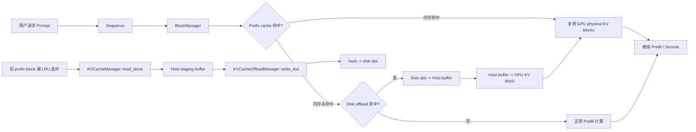
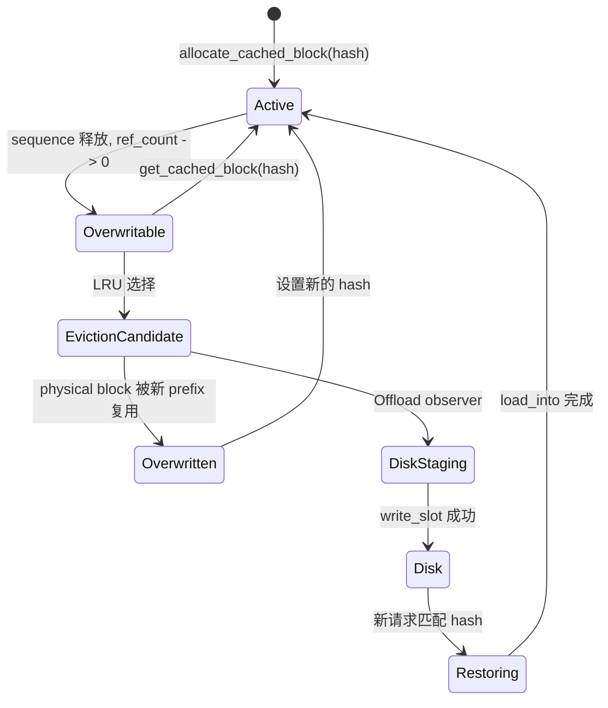
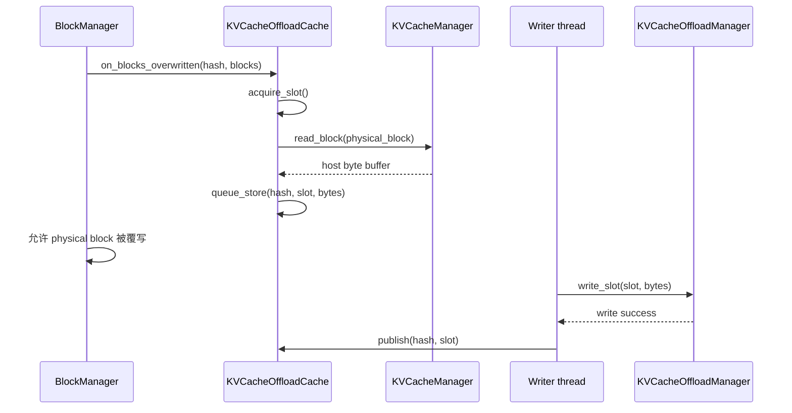
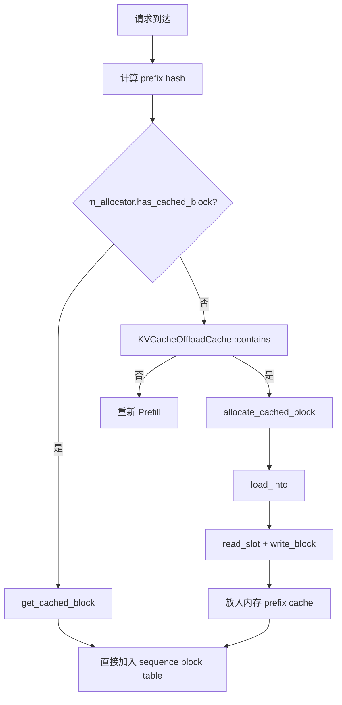

# OpenVINO GenAI Paged KV Cache Offloading

> 基于 `openvino.genai` Continuous Batching + Paged Attention 实现的阶段性成果总结。
>
> 本文适合直接在 VS Code 中使用 **Markdown: Open Preview** 查看。流程图使用 Mermaid 绘制。

## 总览



## 1. KV Cache 是什么

### 1.1 它保存什么

Transformer 在处理第 `t` 个 token 时，需要注意力层访问此前 token 产生的 Key（K）和 Value（V）。如果每次生成新 token 都重新计算所有历史 token，计算量会快速增长。

KV cache 将已经计算过的 K/V 保存下来：

```text
历史 token
    -> Attention layer
    -> K/V tensors
    -> KV cache
    -> 后续 token 直接读取
```

在 OpenVINO GenAI 中，KV cache 由 [`KVCacheManager`](../openvino.genai/src/cpp/src/continuous_batching/cache/kv_cache_manager.hpp) 管理。对于每个 decoder layer，逻辑上有：

```text
m_key_cache[layer]
m_value_cache[layer]
```

Paged Attention 不要求每个 sequence 拥有连续的物理内存，而是使用 block table 将逻辑 block 映射到 physical block：

```text
logical block 0 -> physical block 7
logical block 1 -> physical block 2
logical block 2 -> physical block 9
```

模型只需要根据 block table 找到正确的 physical KV blocks。

### 1.2 为什么要分页

一个 KV block 保存固定数量的 token。例如：

```text
block_size = 32 tokens
```

则一个 85-token prompt 大致分为：

```text
Block 0: token 1  - 32
Block 1: token 33 - 64
Partial: token 65 - 85
```

分页带来的好处：

- 不需要为每个请求预留完整连续的 KV 内存。
- 不同 sequence 可以共享相同 prefix 的 KV block。
- block 可以按 LRU 方式回收和复用。
- physical block 的数量可以直接控制设备侧 KV cache 容量。

相关代码：

- [`CacheBlock`](../openvino.genai/src/cpp/src/continuous_batching/cache/block_manager.hpp)：保存 physical index、prefix hash、引用计数和 LRU 时间。
- [`BlockAllocator`](../openvino.genai/src/cpp/src/continuous_batching/cache/block_manager.hpp)：分配和回收 physical blocks。
- [`BlockManager`](../openvino.genai/src/cpp/src/continuous_batching/cache/block_manager.hpp)：维护 sequence 的 block table 和 prefix cache。

## 2. Prefix Caching

### 2.1 基本思想

如果两个请求拥有相同的 prompt 前缀，那么前缀对应的 KV 结果完全相同，可以直接复用：

```text
Request A: [system, user, question A]
Request B: [system, user, question B]
          ^^^^^^^^^^^^^
          相同 prefix
```

OpenVINO GenAI 使用 prefix hash 标识已经计算过的 prefix block：

```text
prefix hash -> BlocksPerLayer -> physical KV block
```

`BlockManager` 中的核心索引是：

```cpp
m_prefix_hash_to_cached_blocks
```

它表示当前内存中的：

```text
prefix hash -> CacheBlock
```

另外，`OverwritableBlocksHashStore` 保存没有 sequence 持有、但内容仍然有效的 prefix blocks。这些 block 可以：

1. 被相同 prefix 命中并恢复使用。
2. 在设备 cache 需要空间时被 LRU 选中并覆写。

### 2.2 Prefix block 的生命周期



### 2.3 为什么需要连续恢复

prefix block 是按顺序组织的。假设：

```text
block_size = 4
prompt_len = 10
```

循环会检查：

```text
content_len = 4  -> hash(T1..T4)
content_len = 8  -> hash(T1..T8)
```

最后的 hash 只是“前缀身份”，不是包含所有历史 KV 的一个大 block。因此磁盘恢复必须逐 block 进行：

```text
hash(T1..T4) -> physical block 0
hash(T1..T8) -> physical block 1
```

代码位于 [`BlockManager::warm_prefix_cache`](../openvino.genai/src/cpp/src/continuous_batching/cache/block_manager.hpp)。

## 3. KV Cache Offload 实现

### 3.1 组件职责

| 组件 | 职责 |
| --- | --- |
| `CacheOrchestrator` | 创建并连接各类 cache manager；在普通 prefix restore 前触发 disk warm-up |
| `BlockManager` | 管理逻辑 block、physical block、prefix hash 和内存恢复链 |
| `BlockAllocator` | 分配新 block，或选择 LRU overwriteable block |
| `KVCacheManager` | 从 CPU/GPU physical KV block 读取或写回 block bytes |
| `KVCacheOffloadCache` | 管理 hash、staging queue、异步 writer、disk entry 发布和恢复入口 |
| `KVCacheOffloadManager` | 管理文件、固定大小 slot，以及 `read_slot` / `write_slot` |

### 3.2 Store：设备 block 被覆写前保存

`CacheOrchestrator::enable_kv_cache_offload()` 将 `KVCacheOffloadCache` 注册为 BlockManager 的 observer：

```cpp
m_block_managers.at(CacheType::KV_CACHE)
    ->set_overwritten_block_observer(m_kv_offload_cache.get());
```

当 [`OverwritableBlocksHashStore::get_lru_block_to_overwrite`](../openvino.genai/src/cpp/src/continuous_batching/cache/block_manager.hpp) 选择旧 block 时，先执行：

```cpp
m_observer->on_blocks_overwritten(
    overwritten_hash,
    blocks_for_all_layers);
```

这发生在 physical block 被覆写之前，因此旧 KV 仍然有效。



保存调用链：

```text
BlockAllocator::allocate_block(hash, cached_blocks)
  -> OverwritableBlocksHashStore::get_lru_block_to_overwrite()
  -> IOverwrittenBlockObserver::on_blocks_overwritten()
  -> KVCacheOffloadCache::on_blocks_overwritten()
  -> KVCacheManager::read_block()
  -> KVCacheOffloadCache::run_writer()
  -> KVCacheOffloadManager::write_slot()
  -> KVCacheOffloadCache::publish(hash, slot)
```

其中：

- `read_block()` 是同步快照，必须在 block 被覆写前完成。
- `write_slot()` 在后台 writer 线程执行。
- 只有磁盘写入成功后才 `publish`，因此 `publish` 是 hash 到 disk slot 的有效提交点。
- 如果 staging buffer 已满，当前实现会放弃本次保存，让后续请求重新计算，而不会阻塞 block 分配。

### 3.3 Load：磁盘 block 恢复到设备 cache

当前实现采用“先 warm 到内存，再走标准 prefix restore”的两阶段方式。

第一阶段由 [`CacheOrchestrator::restore_cached_blocks`](../openvino.genai/src/cpp/src/continuous_batching/cache/cache_orchestrator.hpp) 执行：

```cpp
KVCacheOffloadCache::ScopedReclamationPause keep_entries(*m_kv_offload_cache);
kv_it->second->warm_prefix_cache(sequence_group, *m_kv_offload_cache);
```

第二阶段由 `BlockManager::warm_prefix_cache()` 逐个检查 prefix：

```cpp
if (m_allocator.has_cached_block(hash, m_prefix_hash_to_cached_blocks)) {
    // 直接使用内存中的 block
}

if (!source.contains(hash)) {
    break;
}

auto blocks = allocate_cached_block(hash, content_len);
source.load_into(hash, blocks[0]->get_index());
```

调用链：

```text
CacheOrchestrator::restore_cached_blocks()
  -> BlockManager::warm_prefix_cache()
  -> KVCacheOffloadCache::contains(hash)
  -> m_entries[hash].slot_id
  -> KVCacheOffloadCache::load_into(hash, block_index)
  -> KVCacheOffloadManager::read_slot(slot_id)
  -> KVCacheManager::write_block(block_index)
  -> free_cached_blocks(blocks)
  -> BlockManager::restore_cached_blocks()
```

这里的 `free_cached_blocks()` 释放的是临时引用，不是删除 KV 数据：

```text
临时 ref_count = 1
    -> free_cached_blocks()
    -> ref_count = 0
    -> 进入 OverwritableBlocksHashStore
    -> 普通 restore 再次 claim
```

### 3.4 内存命中和磁盘命中的区别



当前实现的关键点是：

```text
disk slot 不能直接交给 ModelRunner

必须先：
    disk -> host staging -> device physical block
    再把 physical block index 放进 block table
```

## 4. 阶段性成果

### 4.1 已完成能力

- CPU KV cache 的 prefix block 磁盘 offload。
- Intel GPU `RemoteTensor` block ROI 的读写路径。
- LRU overwrite 前捕获旧 KV block。
- 后台线程写入固定大小 disk slot。
- hash 到 disk slot 的索引发布与恢复。
- 磁盘命中后恢复到新的 device physical block。
- CPU 和 GPU 真实模型 E2E 正确性验证。
- 相同 device cache 容量下，Base 和 Offload 的 device memory 保持一致。
- 不支持的配置会被明确拒绝，例如 `use_cache_eviction=true` 与当前 offload block layout 不兼容。

### 4.2 Qwen3-8B 实测结果

实验条件：

```text
模型：Qwen3-8B OpenVINO 格式
设备：Intel GPU（GPU.0）
Prompt：约 14K tokens 的 roundtrip workload
Base：num_kv_blocks = 1024
Offload：num_kv_blocks = 1024
Offload disk capacity：1 GB
```

结果：

| 指标 | Base | Offload |
| --- | ---: | ---: |
| 第二次相同 prefix 的 P2 延迟 | 约 20.99 s | 约 1.93 s |
| 从磁盘恢复的 blocks | 0 | 879 |
| 输出 MD5 | 一致 | 一致 |
| Device KV cache block 数 | 1024 | 1024 |

在该 workload 下，第二次相同 prefix 请求的 P2 延迟下降约：

$$
1 - \frac{1.93}{20.99} \approx 90.8\%
$$

这说明 offload 的收益来自：

```text
避免长 prefix 重新 Prefill
    > GPU/Host 数据传输 + 磁盘读写 + 恢复成本
```

更准确地说，收益条件是：

$$
T_{recompute} > T_{GPU/Host\ copy} + T_{disk\ write/read} + T_{restore}
$$

### 4.3 证据日志

保存路径：

```text
KVCacheManager read_block physical_block=0 bytes=...
KVCacheOffloadCache queue_store hash=... physical_block=0
KVCacheOffloadManager write_slot slot=0 offset=0 bytes=...
KVCacheOffloadCache publish hash=... slot=0
```

恢复路径：

```text
KVCacheOffloadCache load hash=... source=disk slot=0 physical_block=3
KVCacheOffloadManager read_slot slot=0
KVCacheManager write_block physical_block=3
prefix_warm_from_disk seq=... blocks=...
```

验证 prefix 确实被复用时，应同时检查：

- `prefix_warm_from_disk ... blocks>0`
- `source=disk`
- `scheduled_tokens` 明显小于完整 prompt token 数
- 实际输出非空且与 Base 对比一致

## 5. 当前边界与下一步

当前实现已经证明了完整的语义闭环：

```text
设备 KV block
  -> 覆写前保存
  -> 固定 disk slot
  -> hash 命中
  -> 恢复到新的 physical block
  -> 继续标准 prefix restore
```

仍需进一步工程化的方向：

- 更细粒度的 GPU copy、磁盘 I/O 和 restore 性能优化。
- 更高效的批量传输，需要避免 sparse physical block ID 带来的额外拷贝。
- 更完善的 staging queue 背压策略。
- `use_cache_eviction=true` 下的 per-layer block layout 支持。
- 更系统的磁盘容量淘汰策略和崩溃恢复策略。
- 更大范围的模型、精度和并发 workload 验证。

## 参考代码

- [`CacheOrchestrator`](../openvino.genai/src/cpp/src/continuous_batching/cache/cache_orchestrator.hpp)
- [`BlockManager` / `BlockAllocator`](../openvino.genai/src/cpp/src/continuous_batching/cache/block_manager.hpp)
- [`KVCacheManager`](../openvino.genai/src/cpp/src/continuous_batching/cache/kv_cache_manager.hpp)
- [`KVCacheOffloadCache`](../openvino.genai/src/cpp/src/continuous_batching/cache/kv_cache_offload_cache.cpp)
- [`KVCacheOffloadManager`](../openvino.genai/src/cpp/src/continuous_batching/cache/kv_cache_offload_manager.cpp)
- [Paged KV Cache Offload 施工方案](paged_kv_cache_offload_to_disk_implementation_plan_zh.md)
- [Paged KV Cache Offload 迁移规格](paged_kv_cache_offload_migration_spec_zh.md)
