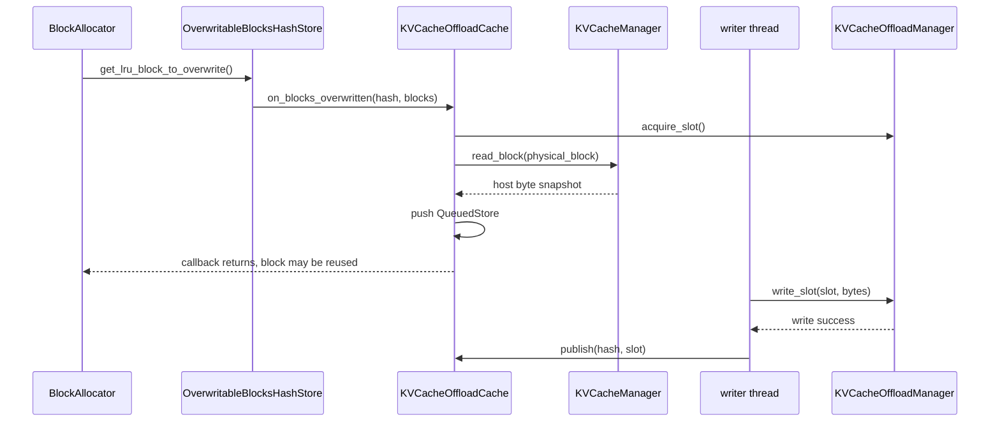
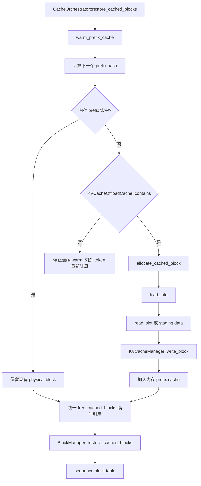

<!-- Copyright (C) 2026 Intel Corporation -->

# OpenVINO GenAI KV Cache Offload 新施工方案

> 本文基于当前 `openvino.genai` 源码、已经完成的 `kv_cache_offloading` 实现，以及 Qwen3-8B CPU/GPU 实测结果重新整理。
>
> 文档目标是区分“已经实现的 v1 闭环”和“下一阶段真正需要施工的功能”，不把概念验证中的多级缓存、跨进程持久化或厂商 SSD 插件误写成当前能力。

> **方案优先级：本文是当前权威施工方案。** 本文与旧版
> `docs/paged_kv_cache_offload_to_disk_implementation_plan_zh.md` 或
> `docs/paged_kv_cache_offload_migration_spec_zh.md` 存在设计差异时，以本文为准；旧文档仅作为历史设计和背景参考。

### 新旧方案的关键取舍

| 主题 | 旧方案中的设计 | 当前方案（以本文为准） |
| --- | --- | --- |
| Offload 层级 | 目标是 L0 Device -> L1 Host -> L2 SSD 的完整三级缓存 | 当前先完成 Device KV -> host staging -> disk slot；独立 L1 延后到 Phase 2 |
| Store 触发点 | 曾考虑在 eviction 路径主动下沉 | 只在 `get_lru_block_to_overwrite()` 覆写前通过 observer 保存 |
| Load 入口 | 目标是把 disk 作为独立 restore source 或异步 load plan | 先由 `CacheOrchestrator` 调用 `warm_prefix_cache()` 回填内存，再复用原有 restore |
| GPU 支持 | 旧文档最初按 CPU first、GPU 后续规划 | 当前 GPU `RemoteTensor` 读写已完成并有真实模型验证 |
| Store/Load 并发 | 曾规划 transfer pin、event 和独立 load 队列 | 当前 store 为 host snapshot 同步、文件写异步；load 在 warm 路径同步完成 |
| 持久化 | 目标包含跨进程、重启、manifest 和模型校验 | 当前 backing file 仍是 pipeline 生命周期内临时文件；持久化列入 Phase 4 |
| SSD 插件 | 曾规划 Vendor SSD C ABI、SPDK、io_uring、GPUDirect | 当前只有内置固定 slot 文件 backend；插件列入 Phase 6 |
| 安全隔离 | 曾规划 tenant ID / cache salt | 当前尚无对应 API 和隔离协议；列入 Phase 5 |

## 1. 结论先行

当前已经实现并验证的能力是：

```text
L0: CPU/GPU physical KV cache
    -> prefix block 进入 OverwritableBlocksHashStore
    -> LRU block 即将被覆写
    -> KVCacheManager::read_block() 同步快照到 host buffer
    -> KVCacheOffloadCache 后台写入固定 disk slot
    -> hash -> slot 发布
    -> 新请求按 hash warm 回新的 physical block
    -> 继续使用原有 BlockManager prefix restore
```

当前实现不是完整的三级缓存系统：

- 没有独立的 L1 HostBlockPool；host buffer 是 store/load 的暂存区。
- 没有跨进程、跨 pipeline 或重启后的持久化索引协议。
- 没有 tenant isolation / cache salt API。
- 没有 Vendor SSD Plugin 或 C ABI。
- 没有独立的异步 load/prefetch 队列；load 在 warm 路径同步完成。
- 当前不支持 `use_cache_eviction=true` 与 offload 同时启用。

后续施工应优先围绕**可证明的性能和生命周期语义**展开，而不是一次性引入所有未来架构。

## 2. 当前代码基线

### 2.1 核心对象

| 代码 | 当前职责 |
| --- | --- |
| [`CacheOrchestrator`](src/cpp/src/continuous_batching/cache/cache_orchestrator.hpp) | 创建 KV manager/block manager；启用 offload；restore 前触发 disk warm |
| [`BlockManager`](src/cpp/src/continuous_batching/cache/block_manager.hpp) | 维护 sequence block table、prefix hash、内存 overwriteable store |
| `BlockAllocator` | 分配新 block，或从 overwriteable store 选 LRU block 覆写 |
| [`KVCacheManager`](src/cpp/src/continuous_batching/cache/kv_cache_manager.hpp) | 按 physical block 读写所有 decoder layer 的 K/V bytes |
| [`KVCacheOffloadCache`](src/cpp/src/continuous_batching/cache/kv_cache_offload_cache.cpp) | hash/slot 索引、staging queue、后台 writer、load source 选择 |
| [`KVCacheOffloadManager`](src/cpp/src/continuous_batching/cache/kv_cache_offload_manager.cpp) | 固定 slot 文件、slot 分配、文件读写 |

### 2.2 当前 block 语义

`BlocksPerLayer` 的长度是 block-table 层数，不等于 decoder layer 数：

```cpp
const bool per_layer_control = config.use_cache_eviction;
const size_t num_block_table_layers =
    per_layer_control ? kv_manager->get_num_layers() : 1;
```

当前 offload 只适用于：

```text
use_cache_eviction == false
BlocksPerLayer.size() == 1
一个 physical block ID 跨所有 decoder layer 表示完整 KV block
```

因此 `KVCacheManager::read_block(block_index)` 可以将所有 layer 的 key/value 组合成一个 disk slot。eviction 模式下每层 physical index 独立，不能直接复用这个 slot 语义。

## 3. 已完成的 Store 闭环

### 3.1 触发点

block 被 sequence 释放后，若 prefix hash 有效，会进入：

```cpp
m_overwriteable_blocks.add(blocks_for_all_layers);
```

真正的内容危险点是：

```cpp
OverwritableBlocksHashStore::get_lru_block_to_overwrite()
```

当前实现会在删除 hash、增加引用计数和返回 block 之前调用 observer：

```cpp
if (m_observer != nullptr) {
    m_observer->on_blocks_overwritten(
        overwritten_hash,
        blocks_for_all_layers);
}
```

这保证 observer 读取时 physical block 仍保存旧 KV。

### 3.2 Store 调用链



代码对应关系：

```text
BlockAllocator::allocate_block()
  -> OverwritableBlocksHashStore::get_lru_block_to_overwrite()
  -> KVCacheOffloadCache::on_blocks_overwritten()
  -> KVCacheManager::read_block()
  -> KVCacheOffloadCache::run_writer()
  -> KVCacheOffloadManager::write_slot()
  -> KVCacheOffloadCache::publish()
```

重要语义：

- `read_block()` 是同步快照；不能等后台线程，因为 physical block 回调返回后马上可能被覆写。
- `write_slot()` 是异步的；后台写入成功后才发布 `hash -> slot`。
- staging queue 满时当前策略是 best effort：丢弃这次 store，让以后重新计算，不阻塞 block allocation。
- `contains()` 和 `load_into()` 会先查询仍在 staging queue 的条目，因此后台写盘期间也可以读取最新 host snapshot。

## 4. 已完成的 Load 闭环

### 4.1 真实入口

当前不是让 `restore_cached_blocks()` 直接查询磁盘，而是由 [`CacheOrchestrator::restore_cached_blocks()`](src/cpp/src/continuous_batching/cache/cache_orchestrator.hpp) 先执行：

```cpp
KVCacheOffloadCache::ScopedReclamationPause keep_entries(*m_kv_offload_cache);
kv_it->second->warm_prefix_cache(sequence_group, *m_kv_offload_cache);
```

`BlockManager::warm_prefix_cache()` 按 prompt 的 hash 链逐个处理：

```cpp
const auto hash = sequence->get_hash(content_len, m_block_size);

if (m_allocator.has_cached_block(hash, m_prefix_hash_to_cached_blocks)) {
    // 内存命中，复用现有 block
}

if (!source.contains(hash)) {
    break;
}

auto blocks = allocate_cached_block(hash, content_len);
source.load_into(hash, blocks[0]->get_index());
```

这里的 `source` 实际是 `KVCacheOffloadCache`，调用的是：

```text
KVCacheOffloadCache::contains(hash)
  -> m_entries.find(hash) 或 find_queued(hash)

KVCacheOffloadCache::load_into(hash, block_index)
  -> staging queue 命中：直接 write_block()
  -> disk entry 命中：read_slot() + write_block()
```

### 4.2 Load 调用链



`free_cached_blocks()` 在 warm 结束时释放的是临时引用，不是删除 KV：

```text
allocate_cached_block  : ref_count 0 -> 1
load_into              : 写入恢复后的 KV bytes
free_cached_blocks     : ref_count 1 -> 0，放入 overwriteable store
restore_cached_blocks  : ref_count 0 -> 1，重新由 sequence 认领
```

这样磁盘恢复可以复用原有 prefix restore 逻辑，同时保证恢复期间整条 chain 不会被立即 LRU 覆写。`ScopedReclamationPause` 则防止 warm 过程为了腾内存而回收掉尚未读完的磁盘条目。

## 5. 当前实现的边界

### 5.1 设备和同步模型

当前代码已经支持并验证：

```text
CPU tensor  -> host byte buffer -> file
GPU RemoteTensor -> host staging buffer -> file
file -> host staging buffer -> GPU RemoteTensor
```

但实现仍是：

- store：GPU/CPU 到 host snapshot 同步，host 到 file 异步。
- load：disk read 和 host 到 device write 在 warm 路径同步完成。
- 没有 GPU direct storage，也没有 batch swap kernel。

### 5.2 配置边界

当前配置使用已有的：

```json
{
  "enable_prefix_caching": true,
  "use_cache_offload": true,
  "cache_offload_config": {
    "capacity_bytes": 1073741824,
    "buffer_slots": 1024,
    "use_page_cache": true
  }
}
```

必须满足：

```text
enable_prefix_caching == true
use_cache_eviction   == false
KV cache input 存在
capacity_bytes >= 一个完整 KV block slot
```

磁盘文件是当前 pipeline 生命周期内的临时 backing file，不能当作跨重启持久化格式使用。

### 5.3 失败和退化策略

以下情况不会破坏正常推理正确性，但会失去对应的 offload 收益：

- staging queue 已满，store 被丢弃。
- 没有可用 disk slot，store 失败。
- disk read/write 失败，当前 hash 不参与恢复。
- prefix hash 在 disk 和内存都不存在，剩余 prompt 重新计算。

## 6. 阶段性成果

### 6.1 正确性和容量

- CPU 与 Intel GPU `RemoteTensor` 路径已完成真实模型 E2E 验证。
- Base 与 Offload 使用相同 `num_kv_blocks` 时，device KV cache 容量不增加。
- 输出与 Base 一致，说明恢复后的 KV block 可以继续参与正常生成。
- 日志可以证明 store/load 闭环：

```text
KVCacheManager read_block ...
KVCacheOffloadCache queue_store ...
KVCacheOffloadManager write_slot ...
KVCacheOffloadCache publish ...

KVCacheOffloadCache load ... source=disk ...
KVCacheOffloadManager read_slot ...
KVCacheManager write_block ...
prefix_warm_from_disk ... blocks>0
```

### 6.2 Qwen3-8B GPU 实测

实验条件：

```text
模型：Qwen3-8B OpenVINO FP16/4-bit
设备：GPU.0
Prompt：约 14K tokens roundtrip workload
Base：num_kv_blocks = 1024
Offload：num_kv_blocks = 1024
Disk capacity：1 GiB
```

代表性结果：

| 指标 | Base | Offload |
| --- | ---: | ---: |
| 第二次相同 prefix 的 P2 延迟 | 约 20.99 s | 约 1.93 s |
| 从磁盘恢复的 block 数 | 0 | 879 |
| 输出 MD5 | 一致 | 一致 |
| Device KV block 数 | 1024 | 1024 |

第二次相同 prefix 请求的 P2 延迟下降约：

$$
1 - \frac{1.93}{20.99} \approx 90.8\%
$$

这个结果只代表该模型、设备、prompt 和配置组合。收益条件是：

$$
T_{recompute} > T_{host\ copy} + T_{disk\ read/write} + T_{restore}
$$

## 7. 新的分阶段施工计划

### Phase 0：稳定当前 v1，补齐契约测试（大部分已完成）

目标：把当前已经能跑的实现固化成可维护的基础层。

当前仓库已经具备 `tests/cpp/kv_cache_offload_manager.cpp` 和
`tests/cpp/kv_cache_offload_cache.cpp`，已覆盖 slot round-trip、slot 分配/释放、容量耗尽、重复 hash、I/O miss、
per-layer 拒绝、overwrite store、disk warm、warm chain 保持、partial release、staging 直读和 COW 等场景。

任务：

1. 为 `KVCacheDiskLayout`、slot offset、slot size 增加单元测试。
2. 覆盖 FP16、INT8、U4/I4 等实际 KV precision 的 block byte size。
3. 覆盖 staging 命中、disk 命中、slot 耗尽、queue 满和 I/O 异常。
4. 验证 warm 失败时不会把半填充 block 注册到 prefix cache。
5. 验证 `ScopedReclamationPause` 下不会回收仍待恢复的磁盘条目。
6. 为 `use_cache_eviction=true` + offload 增加明确拒绝测试。

验证状态：当前 `build_bench` 的 `ENABLE_TESTS` 仍为 `OFF`。独立测试构建已尝试开启，但 CMake 配置阶段因无法从 GitHub 下载 googletest 而被阻塞；因此这些测试目前是已编写、尚未在本机该构建目录执行的状态。

验收标准：关闭 offload 时行为不变；开启 offload 时 CPU/GPU 输出一致；失败时退化为重新计算而不是错误复用。

### Phase 1：性能观测和队列策略

目标：先知道瓶颈在哪里，再决定是否引入复杂的数据路径。

施工状态：已开始实现。当前配置支持队列满时的 drop 或等待策略，统计已覆盖队列峰值、staging/disk/miss
来源和 store/load 分阶段耗时；逐 block trace 默认关闭，可通过配置显式开启。Phase 1 尚未完成的部分是
完整的性能报告，以及更全面的 backpressure 和异常路径测试。当前 `buffer_slots` 默认值为 2，上限为 1024；
每个 slot 持有一个完整 KV block snapshot，因此 staging 内存预算约为 `buffer_slots * slot_size`。

任务：

1. 分开统计 device-to-host、host-to-file、file-to-host、host-to-device 时间。
2. 统计 queue depth、drop 次数、slot reuse、disk hit/miss 和 warm block 数。
3. 为 store queue 增加可配置的 drop/backpressure 策略。
4. 明确 `buffer_slots` 的默认值、上限和内存预算语义。
5. 将日志中的逐 block trace 改为可选诊断开关，默认只输出 request 级统计。

验收标准：不改变结果和默认性能；可以从报告回答“收益来自减少重算，还是只是测试顺序/缓存预热造成”。

### Phase 2：真正的 L1 Host Cache

目标：让 host memory 成为独立、可复用、可淘汰的中间缓存，而不是仅作为 I/O staging。

建议设计：

```text
L0 device block
  -> L1 host block pool
  -> L2 file slot
```

任务：

1. 新增独立 `HostBlockPool`，拥有固定数量的 host blocks。
2. 将 `m_entries` 扩展为 location 状态：`DEVICE`、`HOST`、`DISK`、`STORE_IN_FLIGHT`。
3. store 优先从 L0 搬到 L1；L1 压力达到阈值后再写 L2。
4. load 优先级改为 L1 > L2，避免每次命中都访问文件。
5. 明确 host pool 与现有 `m_staging` 的生命周期、锁和容量关系。

注意：这一阶段不能简单把现有 staging buffer 改名为 HostBlockPool；必须解决 host entry 的长期 ownership、LRU 和 slot 一致性。

施工状态：已实现独立的 `HostBlockPool`（[kv_cache_host_block_pool.hpp](src/cpp/src/continuous_batching/cache/kv_cache_host_block_pool.hpp)），
容量由新增的 `CacheOffloadConfig::host_cache_slots` 配置（默认 0，即关闭，保持旧行为不变）。磁盘写完成
（`publish()`）后不再立即丢弃 host 字节副本，而是写入这个独立 LRU 池；`load_into()` 的命中顺序改为
in-flight staging -> L1 host pool -> L2 disk，磁盘条目被 host 池淘汰或磁盘条目被 LRU 顶替都不会互相影响
对方，两层各自独立淘汰。已覆盖的测试：L1 命中不触发磁盘读、host 池按自身容量独立淘汰（同一 hash 磁盘仍
命中，但改为走磁盘路径）。

已补齐 `HOST`/`DISK`/`STORE_IN_FLIGHT` 三态的统一状态查询：新增 `KVCacheOffloadCache::BlockLocation`
（`in_flight`/`host_resident`/`disk_resident` 三个布尔位，`HOST`/`DISK` 允许同时为真，因为两层本来就
独立淘汰）和公开方法 `get_location(hash)`，`contains()` 与 store 路径的"已存在"判断都改为调用同一个
`locate_unlocked()`，不再各自重复三次查找。已覆盖测试：未知 hash 为全 false；store 尚未落盘前 in-flight
与 disk_resident 不会同时为真；host cache 关闭时只有 DISK；磁盘 slot 被顶替后 host 侧仍能报告 HOST-only；
host+disk 都命中时两位同时为真。

`DEVICE` 态经过讨论后明确不纳入这个统一状态：它由 `BlockManager`/`OverwritableBlocksHashStore` 独立管理和
加锁，`KVCacheOffloadCache` 只通过 `on_blocks_overwritten()` 单向接收通知；把 `DEVICE` 状态镜像进这个类
需要打通两个子系统的边界，代价是引入第二个可能与真实来源不一致的状态副本，收益仅仅是"看起来更完整"，
不改变任何可观察行为，所以未实现，仍按原样只由 `BlockManager` 一侧持有。

store 路径的调度节奏已解耦：`on_blocks_overwritten()` 读到设备字节后立即调用 `m_host_pool.put()`，L1
入口不再等磁盘写完成；`publish()` 现在只登记磁盘 slot，不再触碰 host 池。已用测试验证 L1 在磁盘写完成前
即可命中（`L1IsSeededBeforeDiskWriteCompletes`）。

未采用“L1 压力超阈值才写 L2”的字面语义：磁盘写依然对每一次 store 都无条件发生，而不是只在 L1 淘汰时才
补写。这是有意的取舍——如果改成后者，`host_cache_slots=0`（默认关闭 L1）时将永远不会有任何数据落盘，
直接破坏 Phase 0/1 已经验证过的默认离线能力；即使 `host_cache_slots>0`，把持久化改成仅在内存压力下才
发生，也会让"数据是否已经落盘"变得依赖淘汰时机而不是每次 store 的确定性保证，本 Phase 2 已提交的多个测试
（如 `GetLocationIsHostAndDiskAfterPublishWithHostCacheEnabled`）都假设 flush 后必然可查到磁盘副本。因此
选择了侵入更小、不改变持久化保证的版本：仅解耦"L1 何时可见"，不解耦"是否写 L2"。

### Phase 3：批量 GPU 传输和异步 load

目标：降低大量 sparse physical block 的逐 block 传输开销。

前置条件：Phase 1 已有可靠 cost breakdown，Phase 2 已明确 host entry 生命周期。

任务：

1. 在不改变单 block fallback 的前提下，增加 batch read/write API。
2. 保留 physical block ID 到 destination block ID 的显式映射。
3. 避免为了 batch transfer 把 sparse block 复制到不必要的临时连续 buffer。
4. 引入 load task、completion 和 commit 状态；load 完成前不把 block table 暴露给 ModelRunner。
5. 覆盖 GPU plugin queue 的同步和 RemoteTensor host visibility。

验收标准：batch 路径与单 block 路径输出一致；失败时能逐 block fallback；没有 load 完成前使用未初始化 device block 的窗口。

施工状态：已实现任务 1/2/3（batch API + 单 block fallback + 真实设备侧合批），并在真实 GPU 上验证；
任务 4/5 明确推迟，原因如下。

已完成：`IExternalPrefixSource` 新增 `load_into_many(requests)`，默认实现就是逐个调用 `load_into()`（因此
任何只实现单 block 接口的旧代码不需要改动即可继续工作，天然满足"不改变单 block fallback"）。
`KVCacheOffloadCache` 覆盖了这个方法，把整条 chain 的加锁次数从 N 次降为 1 次（`load_into_unlocked()`
抽出公共逻辑，`load_into()`/`load_into_many()` 都复用它）。`BlockManager::warm_prefix_cache()` 已重构为
两阶段：第一阶段按原有顺序决定每个位置是内存命中还是需要从 source 加载并预先分配好物理 block（分配时机
完全不变，仍然逐个检查 `can_allocate_blocks`）；第二阶段对所有"需要加载"的位置一次性调用
`load_into_many()`，再从第一个失败位置开始整体丢弃（不管失败位置之后是否原本能成功），与逐块调用时"遇错
即 break"的语义完全一致。已用测试验证：批量结果顺序与单请求一一对应；中间某个 hash 缺失不影响其他请求；
默认 fallback 对未覆盖批量接口的实现仍然正确；chain 在第一个失败点被整体截断，即使失败点之后的 block
本来会成功也不会被保留（并记录了这种情况下会有轻微的"多余加载后丢弃"开销，这是正确性优先于极限效率的
有意选择）。

任务 2/3（保留显式 block-id 映射、不为稀疏 block 硬造连续 buffer）和设备侧真正合批现已一并实现：

`KVCacheManager` 新增 `write_blocks(block_ids, flat_blocks_data)`。它按输入顺序找出连续的物理 block ID
区间（例如 `[5,6,7,8)`），对每个区间、每一层，把该层 key/value 段的字节从"block-major"（每个 block 内部
按层顺序排列）重新打包成一个仅覆盖这一层、跨整个区间连续的小 scratch buffer，再用一次 RemoteTensor
拷贝（`copy_block_range_to_tensor`）写完整个区间，而不是每个 block 各拷贝一次。非连续的 ID（区间长度为 1）
完全退化为原有的 `copy_block_to_tensor` 单 block 路径，字节结果保证与逐块调用完全一致——不会为了凑批量
把稀疏 block 硬塞进不必要的连续 buffer；重新打包只发生在本来就连续的区间内部，用于弥合"block-major 源
数据"和"segment-major 设备拷贝"之间的布局差异，这是达成合批本身必须付出的、且远小于省下的设备调用开销
的主机侧内存搬运成本。`KVCacheOffloadCache::load_into_many()` 已接入：批量内先逐个 resolve 出每个请求的
源字节（不落设备），再对全部命中的请求一次性调用 `write_blocks()`，真正把"多次设备调用"降为"按连续区间
数量的设备调用"。

已用测试验证，包括在本机真实 Intel Arc 140T iGPU 上跑通的 RemoteTensor 合批用例：
- CPU：连续区间、稀疏 ID、单区间+多区间混合、单个请求，字节结果与逐块 `write_block()` 完全一致。
- 真实 GPU（`TestCacheManager.test_gpu_batch_write_contiguous_run_matches_per_block` /
  `test_gpu_batch_write_mixed_runs_and_gaps_matches_per_block`）：同样的场景在真实 RemoteTensor 上验证
  通过。
- 接入 `load_into_many` 后，完整的 `TestKVCacheOffloadEndToEnd` 套件在真实 GPU + 真实模型
  （`C:\Users\gta\e2e_gpu_llama`）上重新跑通：输出文本一致、设备内存不增长、offload 命中路径耗时可测。

修正：本机确实装有 Intel(R) Arc(TM) 140T GPU（核显），`ov::Core().get_available_devices()` 能正常识别
（`full_name: Intel(R) Arc(TM) 140T GPU (8GB) (iGPU)`），且已用 `C:\Users\gta\e2e_gpu_llama` 这个现成
导出模型在真实 GPU 上跑通 `TestKVCacheOffloadEndToEnd` 全部非 VLM 用例（4 passed，1 skipped 因为没有
VLM 模型，不是失败）。此前声称"本环境没有可用的 GPU 硬件"是没有先核实就下的错误结论，已更正。因此
"没有硬件可验证"不再是任务 4/5 或设备侧合批的推迟理由；上面 segment-major 布局冲突仍然是设备侧合批
本身的真实技术顾虑，与硬件可用性无关，继续保留。

任务 5（GPU plugin queue 同步、RemoteTensor host visibility）已核实为现有保证，不需要新增代码。证据链
（均为 `openvino` 仓库源码，非本仓库）：
1. `KVCacheManager` 用到的 `ov::RemoteTensor::copy_to()/copy_from()` 分发到
   `RemoteTensorImpl::copy_to`/`copy_from`（`src/plugins/intel_gpu/src/plugin/remote_tensor.cpp`）。
2. 二者内部统一走 `MemWrapper::copy_to()`，其中 `const bool is_blocking = true;` 是无条件硬编码，覆盖
   device↔host、device↔device、sub-byte 等全部路径，没有任何分支会关闭它。
3. 最终落到 `gpu_buffer::copy_from`/`copy_to`（`src/plugins/intel_gpu/src/runtime/ocl/ocl_memory.cpp`），
   把这个 `blocking` 参数直接传给 OpenCL 标准 API `enqueueWriteBuffer`/`enqueueReadBuffer` 的
   `cl_bool blocking` 参数；按 OpenCL 规范，`blocking=CL_TRUE` 时调用在数据传输真正完成前不会返回。

也就是说，`KVCacheManager` 目前用到的每一次单 block 拷贝、以及本次新增的合批区间拷贝，在返回前都已经
被 OpenVINO GPU 插件保证：GPU 命令队列执行完毕且数据对 host/device 双方可见。这不是本仓库需要维护的
不变量，而是 OpenVINO 公共 API `RemoteTensor::copy_to/copy_from` 的既有契约，已经被本次新增的真实 GPU
测试（`test_gpu_batch_write_*`、`TestKVCacheOffloadEndToEnd`）间接验证：如果这个阻塞保证不成立，这些
测试会表现为读到未初始化或旧数据的间歇性失败，而不是稳定通过。

任务 4（load task/completion/commit 状态机，load 完成前不暴露给 ModelRunner）在当前设计下不适用，
而不是被推迟：这个任务描述的问题只有在存在"异步 load 队列"时才会出现（load 已发起但尚未完成、
调用方却已经能看到目标 block）。当前 `warm_prefix_cache()`/`load_into_many()`/`write_blocks()` 全部
是同步调用——函数返回之前，所有涉及的字节已经確定写完（见上面任务 5 的证据），`restore_cached_blocks()`
把 block table 暴露给序列只会发生在 `warm_prefix_cache()` 完全返回之后。也就是说，现在没有"未完成的
load"这个状态可以泄漏给 ModelRunner，因为没有任何东西在异步进行。真正需要任务 4 的前提是先决定要不要
把 disk/host 恢复做成后台异步执行（不阻塞调度器热路径）——这是一个全新的功能需求，不是修补现有代码的
缺口，需要先确认是否有具体的性能证据支撑（例如 Phase 1 的 cost breakdown 显示同步恢复确实阻塞了调度
循环），再决定是否值得引入。

至此 Phase 3 中可以在不引入新的异步架构、且能被真实证据支撑的部分已经全部完成或验证清楚。

### Phase 4：跨重启持久化（已完成）

目标：在语义稳定后，支持可验证的跨 pipeline/重启 cache reuse。

实现（`kv_cache_offload_manager.hpp/.cpp`、`cache_offload.hpp`、`kv_cache_offload_cache.hpp/.cpp`、
`py_continuous_batching_pipeline.cpp`）：

1. **Manifest 格式**：新增两个固定文件名（`ov_genai_kv_offload.data` / `ov_genai_kv_offload.manifest`，
   放在 `CacheOffloadConfig::path` 指定目录下）。Manifest 48 字节 header：magic(4)+format_version(4)+
   slot_size(8)+num_slots(8)+model_fingerprint_hash(8)+tokenizer_fingerprint_hash(8)+layout_fingerprint_hash(8)。
   每个 slot 对应 24 字节 record：hash(8)+checksum(8)+valid(4，实际占 8 字节对齐)。fingerprint 与 layout
   均用 FNV-1a 64 位哈希压缩存储；layout fingerprint 基于每层 key/value segment 的字节大小（不含 offset），
   任何精度/形状变化都会使旧持久化缓存失效。
2. **完整性校验**：`write_slot()` 无论是否启用持久化都会计算并在内存中记录该 slot 内容的 FNV-1a
   checksum；`read_slot()` 读取后重新计算并比对，不一致时抛 `ov::Exception`（与现有"读失败按 miss 处理"
   的调用方行为天然兼容）。
3. **启动校验**：构造函数中，若 `enable_persistence=true`，先尝试 `try_recover_persisted_cache()`：
   校验文件大小、magic、format_version、slot_size、num_slots 以及三个 fingerprint 哈希，任一不匹配则
   放弃恢复、转为 `create_fresh_persisted_files()` 全新创建，绝不会把不兼容的旧数据当成命中。
4. **崩溃安全的写入顺序**：每次持久化写入先写 data 并 `fsync`，再写 hash+checksum 并 `fsync`，最后单独
   写 `valid=1` 标志再 `fsync`。崩溃发生在最后一步之前时，重启后该 record 的 `valid` 仍为 0，等同于
   "从未发生"，不会出现 valid=1 但内容是垃圾的撕裂记录。已用直接篡改 manifest 文件模拟这一场景验证
   （`TornManifestRecordIsIgnoredNotCrashed` 测试）。
5. **显式目录与清理**：持久化模式要求调用方提供非空 `path`（不允许用系统临时目录），并要求非空
   `model_fingerprint`/`tokenizer_fingerprint`。新增静态方法 `KVCacheOffloadManager::remove_persisted_cache
   (directory)` 作为显式清理工具（默认不自动调用）。非持久化模式行为完全不变（仍是 run-specific 临时
   文件，进程退出即删除）。

`KVCacheOffloadCache` 在构造时会读取 `KVCacheOffloadManager::get_recovered_entries()`，把恢复到的
(hash, slot_id) 直接灌入内存索引（`m_entries`/`m_insertion_order`），使其在重启后立刻可读；`run_writer()`
写盘时现在会把 hash 传给 `write_slot()`，只有携带 hash 的写入才会被记录进 manifest。

`CacheOffloadConfig` 新增 `enable_persistence`（默认 false）、`model_fingerprint`、`tokenizer_fingerprint`
三个字段，均已加入 Python 绑定的 `.def_readwrite(...)`。

**V1 已知限制（有意的范围收窄，非疏漏）**：
- 仅精确匹配 `num_slots`/`capacity_bytes`；调整容量会导致整份持久化缓存失效重建，不做部分复用。
- L1 host cache（`HostBlockPool`）不持久化，这是 Phase 2 就确定的范围决策，跨重启后只有 disk 层可命中。
- 校验是"惰性"的：仅在实际 `read_slot()` 时才校验对应 slot 的 checksum，构造时不会扫描全部 slot 数据
  做一次性完整性体检（manifest header/record 本身在构造时会被校验）。
- 未做恢复过程的异步化；`try_recover_persisted_cache()` 是同步执行的（仅扫描 manifest 记录，不读取
  block 数据本身，故耗时应远小于扫描整份 data 文件）。

验证：新增 24 个 `KVCacheOffloadManager` 单元测试（`PersistentCacheDirFixture.*`，覆盖跨重启恢复、
model/tokenizer/layout/slot-count 不匹配安全重建、撕裂 manifest record、数据 checksum 损坏、无 hash 写入
不持久化、`remove_persisted_cache` 清理）以及 1 个 `KVCacheOffloadCache` 集成测试
（`RecoversEntriesFromPersistedCacheAcrossRestart`），全部通过；既有 90+ 项 offload/block-manager/
cache-manager 相关测试及完整 702 项测试套件（17 项已知无关失败）均无回归；真实 GPU E2E
(`TestKVCacheOffloadEndToEnd.*`) 复测通过，确认持久化默认关闭时行为不受影响。

注意：跨重启持久化不等于把当前临时文件留下来。必须先定义兼容性和失效协议。

### Phase 5：安全隔离（已完成）

目标：在持久化格式稳定后，先建立 prefix cache 的安全边界。

实现（`kv_cache_isolation_seed.hpp`、`scheduler_config.hpp`、`block_manager.hpp`、`cache_orchestrator.hpp`、
`kv_cache_offload_manager.hpp/.cpp`、`py_continuous_batching_pipeline.cpp`）：

1. **根种子**：新增 `SchedulerConfig::tenant_id`（`std::string`）和 `SchedulerConfig::cache_salt`
   （`std::string`），均默认为空字符串。新增纯 header-only 工具函数
   `compute_prefix_isolation_seed(tenant_id, cache_salt)`：两者都为空时返回 `0`（显式的"未配置隔离"哨兵值，
   与旧版无隔离行为完全一致，保证单租户部署零回归）；否则用分隔符拼接后做 FNV-1a 哈希，并保证非零（即使
   哈希结果碰巧为 0 也强制返回 1），使得"是否配置了隔离"始终可以用 `seed == 0` 无歧义判断。
2. **默认策略**：未提供 `tenant_id`/`cache_salt` 时，root seed 为 0，`BlockManager::seeded_hash()` 在此
   情况下直接返回 `Sequence::get_hash()` 原始值（不做任何混合），即"默认单租户、不隔离"是一个显式声明的
   状态，而不是留空产生的意外安全边界；这一点在 `SchedulerConfig` 的字段注释和 `to_string()` 输出中都有
   说明（`cache_salt` 的值本身不会被打印，只打印是否已设置，避免把敏感值写入日志)。
3. **隔离生效范围**：`CacheOrchestrator::create()` 在 `register_kv_cache()`/`register_linear_attention_cache()`
   时用 `compute_prefix_isolation_seed()` 计算一次 root seed，传给 `BlockManager` 构造函数；`BlockManager`
   新增私有方法 `seeded_hash()`，是所有块哈希计算的唯一入口（原来分散在 10 处的 `sequence->get_hash(...)`
   调用点已全部替换为 `seeded_hash(sequence, content_length)`），因此内存态 prefix cache 命中、
   `KVCacheOffloadCache` 的 hash 索引、以及传给 disk backend 的 hash 参数，全部自动携带同一个 root seed，
   无需在多处分别处理。
4. **持久化 metadata 隔离**：`KVCacheOffloadManager` 构造函数新增 `tenant_isolation_seed`
   参数（`CacheOrchestrator::enable_kv_cache_offload()` 同样用 `compute_prefix_isolation_seed()` 计算并传入），
   manifest header 版本升至 2（`MANIFEST_FORMAT_VERSION=2`，header 从 48 字节增至 56 字节，新增
   8 字节 `tenant_fp` 字段），`try_recover_persisted_cache()` 校验时把 `tenant_fp` 与当前构造时传入的
   `tenant_isolation_seed` 做精确比较，任一不匹配则整份持久化缓存判定为不兼容、安全丢弃重建（与
   model/tokenizer/layout fingerprint 走同一条"要么完全信任、要么整体重建"的路径，不做部分恢复）。
   `remove_persisted_cache()` 工具不受影响（按目录删除，不关心 tenant）。

验证：新增 7 个 `TestComputePrefixIsolationSeed` 单测（空输入即哨兵 0、非空必非零、确定性、不同
tenant/salt 产生不同种子、拼接歧义不塌陷）；3 个 `TestBlockManager` 单测（默认 seed 与未隔离哈希完全一致、
不同 tenant 对同一内容产生不同哈希、相同 tenant/salt 跨 `BlockManager` 实例产生相同哈希）；2 个
`PersistentCacheDirFixture` 单测（tenant 不匹配安全重建、tenant 匹配跨重启正常恢复）。全部通过；既有
98 项 offload/block-manager/cache-manager 相关测试及完整 714 项测试套件（17 项已知无关失败,与 Phase 4
相同)均无回归；真实 GPU E2E (`TestKVCacheOffloadEndToEnd.*`) 复测通过。

**V1 已知限制（有意的范围收窄）**：
- 隔离粒度是"每个 pipeline 实例一个 tenant"，不是同一进程内按请求切换 tenant 的真正多租户复用（与
  `model_fingerprint`/`tokenizer_fingerprint` 的粒度一致）；如果需要单进程内为不同请求使用不同 tenant，
  需要在这之上再设计一层，当前未实现。
- `cache_salt` 只是一个额外可选值，不是加密学意义上的密钥管理；它本身以明文形式存在于 `SchedulerConfig`
  中，调用方需要自行保护其分发和存储方式。
- 校验粒度是"整份缓存要么完全信任、要么整体重建"，不支持同一 disk 目录下按 tenant 分区共存多份缓存。

安全隔离应先于插件公开，因为插件不能绕过 core 的 hash、tenant 和失效策略。

### Phase 6：第三方存储后端接口（施工顺序 1-2 已完成，3-4 未开始）

目标：在内部文件 backend 语义稳定后，开放不依赖 OpenVINO C++ ABI 的 vendor storage plugin。

#### 6.1 接口边界

核心代码负责：

```text
BlockManager
  -> prefix hash、LRU、block 生命周期
KVCacheManager
  -> device physical block <-> host buffer
KVCacheOffloadCache
  -> hash -> slot 索引、publish、load/store 正确性
Storage backend plugin
  -> host buffer <-> storage slot
```

插件不直接接触 `Sequence`、`BlockManager`、`CacheBlock`、`RemoteTensor` 或 ModelRunner。插件也不决定 LRU、prefix 命中和 slot 淘汰。

#### 6.2 内部 C++ contract（已实现）

实际落地的接口（`src/cpp/src/continuous_batching/cache/i_kv_cache_storage_backend.hpp`）比本节最初的建议
略宽，因为要覆盖已经完成的 Phase 1-5 能力（容量/统计查询、`hash` 参数化的持久化 publish、跨重启恢复），
不是简单的 `contains/acquire/release/write/read/flush`：

```cpp
class IKVCacheStorageBackend {
public:
  virtual ~IKVCacheStorageBackend() = default;
  virtual std::size_t get_slot_size() const = 0;
  virtual std::size_t get_num_slots() const = 0;
  virtual std::size_t get_num_free_slots() const = 0;
  virtual std::optional<std::size_t> acquire_slot() = 0;
  virtual void release_slot(std::size_t slot_id) = 0;
  virtual void write_slot(std::size_t slot_id, const std::vector<std::uint8_t>& data,
                          std::optional<std::size_t> hash = std::nullopt) = 0;
  virtual void read_slot(std::size_t slot_id, std::vector<std::uint8_t>& data) const = 0;
  virtual const std::vector<std::pair<std::size_t, std::size_t>>& get_recovered_entries() const = 0;
  virtual std::string describe() const = 0;
};
```

`KVCacheOffloadCache` 现在只持有 `std::unique_ptr<IKVCacheStorageBackend>`（不再直接引用具体类型），
`CacheOrchestrator` 是唯一负责构造具体 backend 实例并把它交给 `KVCacheOffloadCache` 的地方。

第一步只把现有 `KVCacheOffloadManager` 改造成 `DefaultFileStorageBackend`，不改变 slot layout、临时文件语义或同步结果——
**这一步已完成，但采用的是"让 `KVCacheOffloadManager` 实现该接口"而不是"把类改名为 `DefaultFileStorageBackend`"**：
后者需要一次触及约 90 处调用点（源码 + 现有 30+ 个既存测试）的大规模重命名，收益是纯粹的命名一致性，
没有任何行为或架构上的额外好处；出于风险控制的考虑选择了保留 `KVCacheOffloadManager` 这个名字，
只在类文档注释里明确写出它现在扮演的角色（"这是 openvino_genai 内置的 `DefaultFileStorageBackend`"）。
如果后续确实需要这个名字（例如要公开在某个 C++ API 文档里），可以用 IDE 的语义重命名一次性完成，
风险应该是可控的。

验证：新增 2 个测试（`TestKVCacheOffloadCache.WorksWithThirdPartyStorageBackend`、
`EvictionAndMissPolicyAreBackendAgnostic`），用一个纯内存、不依赖文件系统的 `InMemoryMockStorageBackend`
证明 hash 索引、LRU 淘汰、miss 上报等全部是 `KVCacheOffloadCache` 自己的逻辑，与具体 backend 实现完全无关——
这正是 6.5 节要求的 "mock backend 测试"。全部通过；既有 100 项 offload/block-manager/cache-manager 相关
测试及完整 716 项测试套件（17 项已知无关失败，与之前各阶段相同）均无回归；真实 GPU E2E 复测通过；
Python 绑定重新编译通过（未改动任何 Python 可见 API）。

#### 6.3 稳定 C ABI

第三方 ABI 不应暴露 `std::vector`、`std::string`、`std::function`、`ov::Tensor` 或 `std::shared_ptr`。所有跨 DLL 结构体应包含：

```c
uint32_t struct_size;
uint32_t api_version;
```

建议最小 descriptor：

```c
typedef struct {
  uint32_t struct_size;
  uint32_t api_version;
  uint64_t slot_id;
  void* buffer;
  uint64_t buffer_bytes;
  uint64_t user_data;
} ov_genai_storage_io_t;

typedef struct {
  uint32_t struct_size;
  uint32_t api_version;
  uint64_t capabilities;
  uint64_t slot_bytes;
  uint64_t slot_count;
} ov_genai_storage_info_t;
```

入口采用显式版本协商：

```c
const ov_genai_storage_plugin_t*
ov_genai_get_storage_plugin(uint32_t requested_api_version);
```

#### 6.4 不变量和错误语义

推荐边界：

```text
hash -> slot 由 KVCacheOffloadCache 维护
slot -> bytes 由 backend 维护
```

插件永远不根据 hash 做 prefix policy。写入完成前不能 publish；读取失败不能把 entry 当作有效命中。

buffer ownership 必须明确：

- core 拥有 buffer，plugin 不负责释放。
- synchronous I/O 返回后 plugin 不得继续访问 buffer。
- asynchronous I/O 只能访问到 completion 通知为止。
- plugin 不得写出 `buffer_bytes` 范围。
- alignment、pinned/USM 支持和是否允许 batch 必须通过 capability 声明。

错误码至少区分：

```text
OK / NOT_FOUND / NO_SPACE / IO_ERROR / TIMEOUT
CANCELLED / INCOMPATIBLE_METADATA / UNSUPPORTED
```

其中 `NOT_FOUND` 退化为重新计算，`IO_ERROR` 不 publish，`INCOMPATIBLE_METADATA` 使旧 cache 整体失效。

#### 6.5 capability 和落地顺序

插件能力按可选项声明，不应成为正确性前提：

```text
sync slot I/O
batch I/O
async I/O
pinned/USM host buffer
direct storage / GPUDirect
```

施工顺序：

1. 内置 default backend adapter，行为与现有文件 backend 一致。**已完成**（见 6.2：`IKVCacheStorageBackend` +
   `KVCacheOffloadManager` 实现该接口 + `KVCacheOffloadCache` 只依赖接口类型）。
2. capability、metadata、错误码和 mock backend 测试。**部分完成**：mock backend 测试已完成（见 6.2）；
   capability 声明（`sync/batch/async I/O`、`pinned/USM`）和统一错误码枚举**尚未实现**——当前只有一个
   具体 backend（内置文件实现），没有第二个真实 backend 需要区分能力或错误语义，先添加这些会是没有
   实际调用方的纯声明性代码，因此推迟到真的要接入第一个外部/mock-beyond-test backend 时再做。
3. 动态 `LoadLibrary` / `dlopen` 加载 C ABI，并提供官方 sample plugin。**未开始**。
4. 再接入 io_uring、SPDK、ZNS/FDP 或 GPUDirect 等厂商优化。**未开始**。

插件显式配置但加载失败时默认报错，不应静默切回普通 backend 造成性能结果失真；自动发现的可选优化才允许显式配置 fallback。

### Phase 7：系统级优化

目标：在安全、持久化和插件 contract 稳定后，再做高风险性能优化。

任务：

1. 批量 sparse block 传输，保留单 block fallback。
2. 异步 load/prefetch 和 load/commit 状态机。
3. L1 HostBlockPool 与 L2 storage 的联合淘汰策略。
4. 基于真实 cost breakdown 选择 pinned memory、direct I/O 和 vendor DMA。

任何优化都必须保持：未完成 load 的 physical block 不得暴露给 ModelRunner，失败时可以退化为 recompute。

## 8. 不建议当前立即施工的方向

以下方向可以保留为长期设计，但不应作为当前 v1 的下一步：

- 一次性实现 L0/L1/L2 全量调度器。
- 在 `use_cache_eviction=true` 下复用现有跨层 slot layout。
- 未有真实 cost breakdown 前直接实现 batch swap kernel。
- 将临时 backing file 宣称为跨重启持久化 cache。
- 在 storage contract 未稳定前发布 Vendor SSD C ABI。
- 把 cache salt、tenant metadata 写入 public API 而没有端到端隔离测试。

## 9. 推荐验收矩阵

| 场景 | 需要确认的证据 |
| --- | --- |
| Base | 无 offload store/load；输出正常 |
| CPU Offload | `queue_store`、`write_slot`、`publish`、`source=disk`、输出一致 |
| GPU Offload | `remote=true`、GPU warm/load、输出一致 |
| 内存命中 | 不发生 disk load，走 overwriteable/active restore |
| 磁盘命中 | `prefix_warm_from_disk blocks>0`，`scheduled_tokens` 小于完整 prompt |
| queue 满 | 有 drop 统计，后续重新计算，不能错误复用 |
| slot 满 | 旧 entry 按策略替换或 miss，不能读旧 slot 的错误 hash |
| I/O 失败 | 当前 block 不发布，推理退化为 recompute |
| eviction 冲突 | 明确拒绝配置 |
| 重启 | 当前版本应明确“不支持”，Phase 4 后才加入测试 |

## 参考代码

- [`cache_orchestrator.hpp`](src/cpp/src/continuous_batching/cache/cache_orchestrator.hpp)
- [`block_manager.hpp`](src/cpp/src/continuous_batching/cache/block_manager.hpp)
- [`kv_cache_manager.hpp`](src/cpp/src/continuous_batching/cache/kv_cache_manager.hpp)
- [`kv_cache_offload_cache.cpp`](src/cpp/src/continuous_batching/cache/kv_cache_offload_cache.cpp)
- [`kv_cache_offload_manager.cpp`](src/cpp/src/continuous_batching/cache/kv_cache_offload_manager.cpp)
- [`run_qwen3_8b_direct_bench.ps1`](run_qwen3_8b_direct_bench.ps1)
- [`paged_kv_cache_offload_to_disk_implementation_plan_zh.md`](docs/paged_kv_cache_offload_to_disk_implementation_plan_zh.md)
- [`paged_kv_cache_offload_migration_spec_zh.md`](docs/paged_kv_cache_offload_migration_spec_zh.md)
