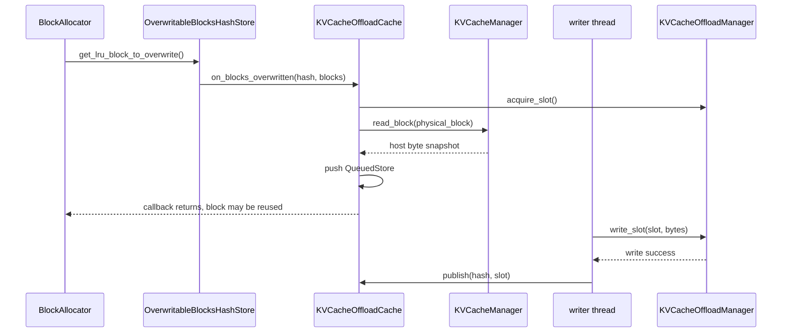
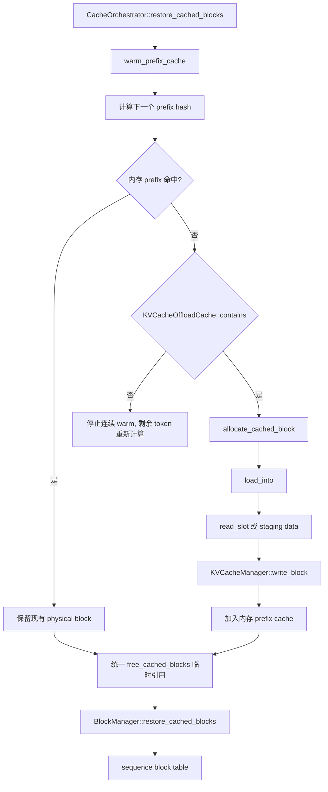

<!-- Copyright (C) 2026 Intel Corporation -->

# OpenVINO GenAI KV Cache Offload 新施工方案

> 本文基于当前 `openvino.genai` 源码、已经完成的 `kv_cache_offloading` 实现，以及 Qwen3-8B CPU/GPU 实测结果重新整理。
>
> 文档目标是区分“已经实现的 v1 闭环”和“下一阶段真正需要施工的功能”，不把概念验证中的多级缓存、跨进程持久化或厂商 SSD 插件误写成当前能力。

> **方案优先级：本文是当前权威施工方案。** 本文与旧版
> `docs/paged_kv_cache_offload_to_disk_implementation_plan_zh.md` 或
> `docs/paged_kv_cache_offload_migration_spec_zh.md` 存在设计差异时，以本文为准；旧文档仅作为历史设计和背景参考。

### 新旧方案的关键取舍

| 主题 | 旧方案中的设计 | 当前方案（以本文为准） |
| --- | --- | --- |
| Offload 层级 | 目标是 L0 Device -> L1 Host -> L2 SSD 的完整三级缓存 | 当前先完成 Device KV -> host staging -> disk slot；独立 L1 延后到 Phase 2 |
| Store 触发点 | 曾考虑在 eviction 路径主动下沉 | 只在 `get_lru_block_to_overwrite()` 覆写前通过 observer 保存 |
| Load 入口 | 目标是把 disk 作为独立 restore source 或异步 load plan | 先由 `CacheOrchestrator` 调用 `warm_prefix_cache()` 回填内存，再复用原有 restore |
| GPU 支持 | 旧文档最初按 CPU first、GPU 后续规划 | 当前 GPU `RemoteTensor` 读写已完成并有真实模型验证 |
| Store/Load 并发 | 曾规划 transfer pin、event 和独立 load 队列 | 当前 store 为 host snapshot 同步、文件写异步；load 在 warm 路径同步完成 |
| 持久化 | 目标包含跨进程、重启、manifest 和模型校验 | 当前 backing file 仍是 pipeline 生命周期内临时文件；持久化列入 Phase 4 |
| SSD 插件 | 曾规划 Vendor SSD C ABI、SPDK、io_uring、GPUDirect | 当前只有内置固定 slot 文件 backend；插件列入 Phase 6 |
| 安全隔离 | 曾规划 tenant ID / cache salt | 当前尚无对应 API 和隔离协议；列入 Phase 5 |

## 1. 结论先行

当前已经实现并验证的能力是：

```text
L0: CPU/GPU physical KV cache
    -> prefix block 进入 OverwritableBlocksHashStore
    -> LRU block 即将被覆写
    -> KVCacheManager::read_block() 同步快照到 host buffer
    -> KVCacheOffloadCache 后台写入固定 disk slot
    -> hash -> slot 发布
    -> 新请求按 hash warm 回新的 physical block
    -> 继续使用原有 BlockManager prefix restore
```

当前实现不是完整的三级缓存系统：

- 没有独立的 L1 HostBlockPool；host buffer 是 store/load 的暂存区。
- 没有跨进程、跨 pipeline 或重启后的持久化索引协议。
- 没有 tenant isolation / cache salt API。
- 没有 Vendor SSD Plugin 或 C ABI。
- 没有独立的异步 load/prefetch 队列；load 在 warm 路径同步完成。
- 当前不支持 `use_cache_eviction=true` 与 offload 同时启用。

后续施工应优先围绕**可证明的性能和生命周期语义**展开，而不是一次性引入所有未来架构。

## 2. 当前代码基线

### 2.1 核心对象

| 代码 | 当前职责 |
| --- | --- |
| [`CacheOrchestrator`](src/cpp/src/continuous_batching/cache/cache_orchestrator.hpp) | 创建 KV manager/block manager；启用 offload；restore 前触发 disk warm |
| [`BlockManager`](src/cpp/src/continuous_batching/cache/block_manager.hpp) | 维护 sequence block table、prefix hash、内存 overwriteable store |
| `BlockAllocator` | 分配新 block，或从 overwriteable store 选 LRU block 覆写 |
| [`KVCacheManager`](src/cpp/src/continuous_batching/cache/kv_cache_manager.hpp) | 按 physical block 读写所有 decoder layer 的 K/V bytes |
| [`KVCacheOffloadCache`](src/cpp/src/continuous_batching/cache/kv_cache_offload_cache.cpp) | hash/slot 索引、staging queue、后台 writer、load source 选择 |
| [`KVCacheOffloadManager`](src/cpp/src/continuous_batching/cache/kv_cache_offload_manager.cpp) | 固定 slot 文件、slot 分配、文件读写 |

### 2.2 当前 block 语义

`BlocksPerLayer` 的长度是 block-table 层数，不等于 decoder layer 数：

```cpp
const bool per_layer_control = config.use_cache_eviction;
const size_t num_block_table_layers =
    per_layer_control ? kv_manager->get_num_layers() : 1;
```

当前 offload 只适用于：

```text
use_cache_eviction == false
BlocksPerLayer.size() == 1
一个 physical block ID 跨所有 decoder layer 表示完整 KV block
```

因此 `KVCacheManager::read_block(block_index)` 可以将所有 layer 的 key/value 组合成一个 disk slot。eviction 模式下每层 physical index 独立，不能直接复用这个 slot 语义。

## 3. 已完成的 Store 闭环

### 3.1 触发点

block 被 sequence 释放后，若 prefix hash 有效，会进入：

```cpp
m_overwriteable_blocks.add(blocks_for_all_layers);
```

真正的内容危险点是：

```cpp
OverwritableBlocksHashStore::get_lru_block_to_overwrite()
```

当前实现会在删除 hash、增加引用计数和返回 block 之前调用 observer：

```cpp
if (m_observer != nullptr) {
    m_observer->on_blocks_overwritten(
        overwritten_hash,
        blocks_for_all_layers);
}
```

这保证 observer 读取时 physical block 仍保存旧 KV。

### 3.2 Store 调用链



代码对应关系：

```text
BlockAllocator::allocate_block()
  -> OverwritableBlocksHashStore::get_lru_block_to_overwrite()
  -> KVCacheOffloadCache::on_blocks_overwritten()
  -> KVCacheManager::read_block()
  -> KVCacheOffloadCache::run_writer()
  -> KVCacheOffloadManager::write_slot()
  -> KVCacheOffloadCache::publish()
```

重要语义：

- `read_block()` 是同步快照；不能等后台线程，因为 physical block 回调返回后马上可能被覆写。
- `write_slot()` 是异步的；后台写入成功后才发布 `hash -> slot`。
- staging queue 满时当前策略是 best effort：丢弃这次 store，让以后重新计算，不阻塞 block allocation。
- `contains()` 和 `load_into()` 会先查询仍在 staging queue 的条目，因此后台写盘期间也可以读取最新 host snapshot。

## 4. 已完成的 Load 闭环

### 4.1 真实入口

当前不是让 `restore_cached_blocks()` 直接查询磁盘，而是由 [`CacheOrchestrator::restore_cached_blocks()`](src/cpp/src/continuous_batching/cache/cache_orchestrator.hpp) 先执行：

```cpp
KVCacheOffloadCache::ScopedReclamationPause keep_entries(*m_kv_offload_cache);
kv_it->second->warm_prefix_cache(sequence_group, *m_kv_offload_cache);
```

`BlockManager::warm_prefix_cache()` 按 prompt 的 hash 链逐个处理：

```cpp
const auto hash = sequence->get_hash(content_len, m_block_size);

if (m_allocator.has_cached_block(hash, m_prefix_hash_to_cached_blocks)) {
    // 内存命中，复用现有 block
}

if (!source.contains(hash)) {
    break;
}

auto blocks = allocate_cached_block(hash, content_len);
source.load_into(hash, blocks[0]->get_index());
```

这里的 `source` 实际是 `KVCacheOffloadCache`，调用的是：

```text
KVCacheOffloadCache::contains(hash)
  -> m_entries.find(hash) 或 find_queued(hash)

KVCacheOffloadCache::load_into(hash, block_index)
  -> staging queue 命中：直接 write_block()
  -> disk entry 命中：read_slot() + write_block()
```

### 4.2 Load 调用链



`free_cached_blocks()` 在 warm 结束时释放的是临时引用，不是删除 KV：

```text
allocate_cached_block  : ref_count 0 -> 1
load_into              : 写入恢复后的 KV bytes
free_cached_blocks     : ref_count 1 -> 0，放入 overwriteable store
restore_cached_blocks  : ref_count 0 -> 1，重新由 sequence 认领
```

这样磁盘恢复可以复用原有 prefix restore 逻辑，同时保证恢复期间整条 chain 不会被立即 LRU 覆写。`ScopedReclamationPause` 则防止 warm 过程为了腾内存而回收掉尚未读完的磁盘条目。

## 5. 当前实现的边界

### 5.1 设备和同步模型

当前代码已经支持并验证：

```text
CPU tensor  -> host byte buffer -> file
GPU RemoteTensor -> host staging buffer -> file
file -> host staging buffer -> GPU RemoteTensor
```

但实现仍是：

- store：GPU/CPU 到 host snapshot 同步，host 到 file 异步。
- load：disk read 和 host 到 device write 在 warm 路径同步完成。
- 没有 GPU direct storage，也没有 batch swap kernel。

### 5.2 配置边界

当前配置使用已有的：

```json
{
  "enable_prefix_caching": true,
  "use_cache_offload": true,
  "cache_offload_config": {
    "capacity_bytes": 1073741824,
    "buffer_slots": 1024,
    "use_page_cache": true
  }
}
```

必须满足：

```text
enable_prefix_caching == true
use_cache_eviction   == false
KV cache input 存在
capacity_bytes >= 一个完整 KV block slot
```

磁盘文件是当前 pipeline 生命周期内的临时 backing file，不能当作跨重启持久化格式使用。

### 5.3 失败和退化策略

以下情况不会破坏正常推理正确性，但会失去对应的 offload 收益：

- staging queue 已满，store 被丢弃。
- 没有可用 disk slot，store 失败。
- disk read/write 失败，当前 hash 不参与恢复。
- prefix hash 在 disk 和内存都不存在，剩余 prompt 重新计算。

## 6. 阶段性成果

### 6.1 正确性和容量

- CPU 与 Intel GPU `RemoteTensor` 路径已完成真实模型 E2E 验证。
- Base 与 Offload 使用相同 `num_kv_blocks` 时，device KV cache 容量不增加。
- 输出与 Base 一致，说明恢复后的 KV block 可以继续参与正常生成。
- 日志可以证明 store/load 闭环：

```text
KVCacheManager read_block ...
KVCacheOffloadCache queue_store ...
KVCacheOffloadManager write_slot ...
KVCacheOffloadCache publish ...

KVCacheOffloadCache load ... source=disk ...
KVCacheOffloadManager read_slot ...
KVCacheManager write_block ...
prefix_warm_from_disk ... blocks>0
```

### 6.2 Qwen3-8B GPU 实测

实验条件：

```text
模型：Qwen3-8B OpenVINO FP16/4-bit
设备：GPU.0
Prompt：约 14K tokens roundtrip workload
Base：num_kv_blocks = 1024
Offload：num_kv_blocks = 1024
Disk capacity：1 GiB
```

代表性结果：

| 指标 | Base | Offload |
| --- | ---: | ---: |
| 第二次相同 prefix 的 P2 延迟 | 约 20.99 s | 约 1.93 s |
| 从磁盘恢复的 block 数 | 0 | 879 |
| 输出 MD5 | 一致 | 一致 |
| Device KV block 数 | 1024 | 1024 |

第二次相同 prefix 请求的 P2 延迟下降约：

$$
1 - \frac{1.93}{20.99} \approx 90.8\%
$$

这个结果只代表该模型、设备、prompt 和配置组合。收益条件是：

$$
T_{recompute} > T_{host\ copy} + T_{disk\ read/write} + T_{restore}
$$

## 7. 新的分阶段施工计划

### Phase 0：稳定当前 v1，补齐契约测试（大部分已完成）

目标：把当前已经能跑的实现固化成可维护的基础层。

当前仓库已经具备 `tests/cpp/kv_cache_offload_manager.cpp` 和
`tests/cpp/kv_cache_offload_cache.cpp`，已覆盖 slot round-trip、slot 分配/释放、容量耗尽、重复 hash、I/O miss、
per-layer 拒绝、overwrite store、disk warm、warm chain 保持、partial release、staging 直读和 COW 等场景。

任务：

1. 为 `KVCacheDiskLayout`、slot offset、slot size 增加单元测试。
2. 覆盖 FP16、INT8、U4/I4 等实际 KV precision 的 block byte size。
3. 覆盖 staging 命中、disk 命中、slot 耗尽、queue 满和 I/O 异常。
4. 验证 warm 失败时不会把半填充 block 注册到 prefix cache。
5. 验证 `ScopedReclamationPause` 下不会回收仍待恢复的磁盘条目。
6. 为 `use_cache_eviction=true` + offload 增加明确拒绝测试。

验证状态：当前 `build_bench` 的 `ENABLE_TESTS` 仍为 `OFF`。独立测试构建已尝试开启，但 CMake 配置阶段因无法从 GitHub 下载 googletest 而被阻塞；因此这些测试目前是已编写、尚未在本机该构建目录执行的状态。

验收标准：关闭 offload 时行为不变；开启 offload 时 CPU/GPU 输出一致；失败时退化为重新计算而不是错误复用。

### Phase 1：性能观测和队列策略

目标：先知道瓶颈在哪里，再决定是否引入复杂的数据路径。

任务：

1. 分开统计 device-to-host、host-to-file、file-to-host、host-to-device 时间。
2. 统计 queue depth、drop 次数、slot reuse、disk hit/miss 和 warm block 数。
3. 为 store queue 增加可配置的 drop/backpressure 策略。
4. 明确 `buffer_slots` 的默认值、上限和内存预算语义。
5. 将日志中的逐 block trace 改为可选诊断开关，默认只输出 request 级统计。

验收标准：不改变结果和默认性能；可以从报告回答“收益来自减少重算，还是只是测试顺序/缓存预热造成”。

### Phase 2：真正的 L1 Host Cache

目标：让 host memory 成为独立、可复用、可淘汰的中间缓存，而不是仅作为 I/O staging。

建议设计：

```text
L0 device block
  -> L1 host block pool
  -> L2 file slot
```

任务：

1. 新增独立 `HostBlockPool`，拥有固定数量的 host blocks。
2. 将 `m_entries` 扩展为 location 状态：`DEVICE`、`HOST`、`DISK`、`STORE_IN_FLIGHT`。
3. store 优先从 L0 搬到 L1；L1 压力达到阈值后再写 L2。
4. load 优先级改为 L1 > L2，避免每次命中都访问文件。
5. 明确 host pool 与现有 `m_staging` 的生命周期、锁和容量关系。

注意：这一阶段不能简单把现有 staging buffer 改名为 HostBlockPool；必须解决 host entry 的长期 ownership、LRU 和 slot 一致性。

### Phase 3：批量 GPU 传输和异步 load

目标：降低大量 sparse physical block 的逐 block 传输开销。

前置条件：Phase 1 已有可靠 cost breakdown，Phase 2 已明确 host entry 生命周期。

任务：

1. 在不改变单 block fallback 的前提下，增加 batch read/write API。
2. 保留 physical block ID 到 destination block ID 的显式映射。
3. 避免为了 batch transfer 把 sparse block 复制到不必要的临时连续 buffer。
4. 引入 load task、completion 和 commit 状态；load 完成前不把 block table 暴露给 ModelRunner。
5. 覆盖 GPU plugin queue 的同步和 RemoteTensor host visibility。

验收标准：batch 路径与单 block 路径输出一致；失败时能逐 block fallback；没有 load 完成前使用未初始化 device block 的窗口。

### Phase 4：跨重启持久化

目标：在语义稳定后，支持可验证的跨 pipeline/重启 cache reuse。

任务：

1. 定义 manifest 版本、模型 fingerprint、tokenizer fingerprint、KV layout、precision、block size 和 slot size。
2. 对每个 slot 增加完整性校验，例如 checksum 和有效状态。
3. 启动时校验 metadata；不匹配时安全忽略或重建，不允许误命中。
4. 处理崩溃期间的未完成 write 和 manifest 更新顺序。
5. 设计显式 cache directory 和 cleanup 策略，替代当前 run-specific 临时文件。

注意：跨重启持久化不等于把当前临时文件留下来。必须先定义兼容性和失效协议。

### Phase 5：安全隔离

目标：在持久化格式稳定后，先建立 prefix cache 的安全边界。

任务：

1. 将 `tenant_id` 和可选 `cache_salt` 纳入 prefix hash 的根种子。
2. 明确未提供 tenant 信息时的默认策略，避免无意间跨租户或跨 session 复用。
3. 补充跨租户、不同 salt、不同模型和不同 tokenizer 的命中隔离测试。
4. 将隔离信息纳入持久化 metadata，metadata 不匹配时只能 miss，不能尝试恢复。

安全隔离应先于插件公开，因为插件不能绕过 core 的 hash、tenant 和失效策略。

### Phase 6：第三方存储后端接口

目标：在内部文件 backend 语义稳定后，开放不依赖 OpenVINO C++ ABI 的 vendor storage plugin。

#### 6.1 接口边界

核心代码负责：

```text
BlockManager
  -> prefix hash、LRU、block 生命周期
KVCacheManager
  -> device physical block <-> host buffer
KVCacheOffloadCache
  -> hash -> slot 索引、publish、load/store 正确性
Storage backend plugin
  -> host buffer <-> storage slot
```

插件不直接接触 `Sequence`、`BlockManager`、`CacheBlock`、`RemoteTensor` 或 ModelRunner。插件也不决定 LRU、prefix 命中和 slot 淘汰。

#### 6.2 内部 C++ contract

先在 `KVCacheOffloadCache` 和文件 backend 之间定义内部接口，建议包含：

```cpp
class IKVCacheStorageBackend {
public:
  virtual ~IKVCacheStorageBackend() = default;
  virtual bool contains(std::size_t slot_id) const = 0;
  virtual std::optional<std::size_t> acquire_slot() = 0;
  virtual void release_slot(std::size_t slot_id) = 0;
  virtual void write_slot(std::size_t slot_id,
              const std::vector<std::uint8_t>& data) = 0;
  virtual void read_slot(std::size_t slot_id,
               std::vector<std::uint8_t>& data) const = 0;
  virtual void flush() = 0;
};
```

第一步只把现有 `KVCacheOffloadManager` 改造成 `DefaultFileStorageBackend`，不改变 slot layout、临时文件语义或同步结果。

#### 6.3 稳定 C ABI

第三方 ABI 不应暴露 `std::vector`、`std::string`、`std::function`、`ov::Tensor` 或 `std::shared_ptr`。所有跨 DLL 结构体应包含：

```c
uint32_t struct_size;
uint32_t api_version;
```

建议最小 descriptor：

```c
typedef struct {
  uint32_t struct_size;
  uint32_t api_version;
  uint64_t slot_id;
  void* buffer;
  uint64_t buffer_bytes;
  uint64_t user_data;
} ov_genai_storage_io_t;

typedef struct {
  uint32_t struct_size;
  uint32_t api_version;
  uint64_t capabilities;
  uint64_t slot_bytes;
  uint64_t slot_count;
} ov_genai_storage_info_t;
```

入口采用显式版本协商：

```c
const ov_genai_storage_plugin_t*
ov_genai_get_storage_plugin(uint32_t requested_api_version);
```

#### 6.4 不变量和错误语义

推荐边界：

```text
hash -> slot 由 KVCacheOffloadCache 维护
slot -> bytes 由 backend 维护
```

插件永远不根据 hash 做 prefix policy。写入完成前不能 publish；读取失败不能把 entry 当作有效命中。

buffer ownership 必须明确：

- core 拥有 buffer，plugin 不负责释放。
- synchronous I/O 返回后 plugin 不得继续访问 buffer。
- asynchronous I/O 只能访问到 completion 通知为止。
- plugin 不得写出 `buffer_bytes` 范围。
- alignment、pinned/USM 支持和是否允许 batch 必须通过 capability 声明。

错误码至少区分：

```text
OK / NOT_FOUND / NO_SPACE / IO_ERROR / TIMEOUT
CANCELLED / INCOMPATIBLE_METADATA / UNSUPPORTED
```

其中 `NOT_FOUND` 退化为重新计算，`IO_ERROR` 不 publish，`INCOMPATIBLE_METADATA` 使旧 cache 整体失效。

#### 6.5 capability 和落地顺序

插件能力按可选项声明，不应成为正确性前提：

```text
sync slot I/O
batch I/O
async I/O
pinned/USM host buffer
direct storage / GPUDirect
```

施工顺序：

1. 内置 default backend adapter，行为与现有文件 backend 一致。
2. capability、metadata、错误码和 mock backend 测试。
3. 动态 `LoadLibrary` / `dlopen` 加载 C ABI，并提供官方 sample plugin。
4. 再接入 io_uring、SPDK、ZNS/FDP 或 GPUDirect 等厂商优化。

插件显式配置但加载失败时默认报错，不应静默切回普通 backend 造成性能结果失真；自动发现的可选优化才允许显式配置 fallback。

### Phase 7：系统级优化

目标：在安全、持久化和插件 contract 稳定后，再做高风险性能优化。

任务：

1. 批量 sparse block 传输，保留单 block fallback。
2. 异步 load/prefetch 和 load/commit 状态机。
3. L1 HostBlockPool 与 L2 storage 的联合淘汰策略。
4. 基于真实 cost breakdown 选择 pinned memory、direct I/O 和 vendor DMA。

任何优化都必须保持：未完成 load 的 physical block 不得暴露给 ModelRunner，失败时可以退化为 recompute。

## 8. 不建议当前立即施工的方向

以下方向可以保留为长期设计，但不应作为当前 v1 的下一步：

- 一次性实现 L0/L1/L2 全量调度器。
- 在 `use_cache_eviction=true` 下复用现有跨层 slot layout。
- 未有真实 cost breakdown 前直接实现 batch swap kernel。
- 将临时 backing file 宣称为跨重启持久化 cache。
- 在 storage contract 未稳定前发布 Vendor SSD C ABI。
- 把 cache salt、tenant metadata 写入 public API 而没有端到端隔离测试。

## 9. 推荐验收矩阵

| 场景 | 需要确认的证据 |
| --- | --- |
| Base | 无 offload store/load；输出正常 |
| CPU Offload | `queue_store`、`write_slot`、`publish`、`source=disk`、输出一致 |
| GPU Offload | `remote=true`、GPU warm/load、输出一致 |
| 内存命中 | 不发生 disk load，走 overwriteable/active restore |
| 磁盘命中 | `prefix_warm_from_disk blocks>0`，`scheduled_tokens` 小于完整 prompt |
| queue 满 | 有 drop 统计，后续重新计算，不能错误复用 |
| slot 满 | 旧 entry 按策略替换或 miss，不能读旧 slot 的错误 hash |
| I/O 失败 | 当前 block 不发布，推理退化为 recompute |
| eviction 冲突 | 明确拒绝配置 |
| 重启 | 当前版本应明确“不支持”，Phase 4 后才加入测试 |

## 参考代码

- [`cache_orchestrator.hpp`](src/cpp/src/continuous_batching/cache/cache_orchestrator.hpp)
- [`block_manager.hpp`](src/cpp/src/continuous_batching/cache/block_manager.hpp)
- [`kv_cache_manager.hpp`](src/cpp/src/continuous_batching/cache/kv_cache_manager.hpp)
- [`kv_cache_offload_cache.cpp`](src/cpp/src/continuous_batching/cache/kv_cache_offload_cache.cpp)
- [`kv_cache_offload_manager.cpp`](src/cpp/src/continuous_batching/cache/kv_cache_offload_manager.cpp)
- [`run_qwen3_8b_direct_bench.ps1`](run_qwen3_8b_direct_bench.ps1)
- [`paged_kv_cache_offload_to_disk_implementation_plan_zh.md`](docs/paged_kv_cache_offload_to_disk_implementation_plan_zh.md)
- [`paged_kv_cache_offload_migration_spec_zh.md`](docs/paged_kv_cache_offload_migration_spec_zh.md)
