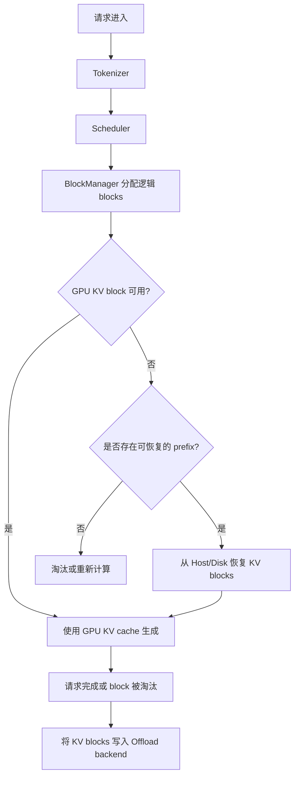

# OpenVINO GenAI KV Cache Offloading

## 1. 一句话总结

KV Cache Offloading 的目标是：**当 GPU device KV cache 容量有限时，把暂时不用的 KV blocks 转移到更低层级的存储，并在相同 prefix 再次出现时恢复回来，避免重新计算整段上下文。**

本阶段已经完成并验证了：

- CPU 与 Intel GPU RemoteTensor 路径的真实模型 E2E 验证。
- GPU KV blocks 的 device ↔ host/disk store/load 闭环。
- 恢复后的 KV blocks 可以继续参与正常生成。
- 在相同 `num_kv_blocks` 下，Offload 不增加 device KV cache 容量。
- 重复 prefix 场景下，Offload 可以显著降低第二次请求的延迟。

## 2. 为什么需要 KV Cache Offloading

KV cache 能避免重复计算历史 token，但 GPU 显存中的 KV cache 容量有限。当请求较长、并发较高，或者多个请求拥有不同 prefix 时，GPU cache 可能被填满。

没有 offloading 时，系统通常只能：

```text
GPU cache 满
    -> 淘汰或丢弃旧 KV blocks
    -> 相同 prefix 再次到达
    -> 重新执行完整 prompt prefill
```

有 offloading 时：

```text
GPU cache 满
    -> 将暂时不用的 KV blocks 写入 host/disk
    -> 释放 GPU 上的 block
    -> 相同 prefix 再次到达
    -> 从 host/disk 恢复 KV blocks
    -> 继续生成，避免完整 prefix 重算
```

核心收益不是让单次 decode 更快，而是**在有限 GPU KV cache 下保留更多可复用的历史计算结果**。

## 3. 一次请求中的 KV Cache 流程



主要模块职责：

| 模块 | 作用 |
|---|---|
| `Scheduler` | 决定请求本轮如何运行，以及 cache 不足时如何处理 |
| `BlockManager` | 管理逻辑 block、block ownership 和 prefix 映射 |
| `KVCacheManager` | 负责 GPU KV block 的读写和 block copy |
| `KVCacheOffloadCache` | 管理已 offload 的 KV blocks、索引和恢复状态 |
| `KVCacheOffloadManager` | 组织 store/load 生命周期和 offload slot |
| Storage backend | 将 KV block 写入 host memory、disk 或 vendor backend |
| `RemoteTensor` | 负责 CPU 与 Intel GPU RemoteTensor 之间的数据搬运 |

## 4. GPU KV Cache 的三层视图

可以把系统理解成三个存储层级：

```text
L0: GPU device KV cache
    延迟最低，容量最有限

L1: Host memory KV cache
    容量更大，搬运成本高于 GPU

L2: Disk / vendor storage backend
    容量最大，访问延迟最高，但可以持久化
```

典型生命周期：

```text
GPU KV block
    -> store 到 Host/Disk
    -> GPU block 释放给新请求
    -> prefix 再次命中
    -> load 回 GPU
    -> 恢复 block table
    -> 继续 PagedAttention 和生成
```

当前阶段已经验证 CPU 路径和 Intel GPU RemoteTensor 路径可以完成这个闭环。

## 5. 一个具体例子

假设 GPU KV cache 配置为：

```text
num_kv_blocks = 1024
```

某个约 14K-token 的请求生成后，占用了大量 KV blocks。随后另一个请求使用相同 prefix：

### Base 模式

```text
1. P0 处理并生成
2. GPU cache 中没有可直接复用的 prefix block
3. P2 再次到达
4. 重新执行完整 prefix prefill
5. 产生较高延迟
```

### Offload 模式

```text
1. P0 处理并生成
2. 部分 prefix KV blocks 被 store 到 disk
3. GPU device cache 仍保持 1024 blocks 的容量
4. P2 再次到达，命中相同 prefix
5. 从 disk load 已保存的 KV blocks
6. 恢复 879 个 blocks
7. 继续正常生成，不需要完整重算 prefix
```

关键点：

> Offload 不是增加 GPU cache 的 block 数量，而是把暂时不用的 block 放到更低层级；恢复时再把它们加载回 GPU。

## 6. 关键配置与含义

### `num_kv_blocks`

```text
num_kv_blocks = 1024
```

表示 GPU device KV cache 的 block 容量。Base 和 Offload 使用相同的值时，可以直接比较 offloading 是否在不增加 GPU cache 的情况下减少重复计算。

本次实验中：

```text
Base:    1024 device KV blocks
Offload: 1024 device KV blocks
```

因此 Offload 的收益不是来自更大的 GPU cache，而是来自保存和恢复了 GPU 之外的 KV blocks。

### Offload capacity

本次 GPU 实验使用：

```text
Disk capacity = 1 GiB
```

它决定低层存储可以保存多少 KV block。disk capacity 越大，能够保留的 prefix 越多，但恢复时会受到磁盘访问带宽和延迟影响。

### Prefix identity

Offload 能否避免重新计算，取决于请求是否命中之前保存的 prefix。系统需要根据 prefix 内容和相关 cache metadata 找到对应的已保存 blocks。

```text
相同 prefix -> 可以恢复
不同 prefix -> 不能直接复用
```

### KV cache precision

KV precision 会影响每个 block 的大小，从而影响：

- GPU 可容纳的 block 数；
- Host/Disk 可保存的 block 数；
- store/load 数据量；
- 恢复延迟。

## 7. Store / Load 闭环

### Store

当 GPU cache 需要给新请求让出空间时：

```text
1. 选出可以 offload 的 KV blocks
2. 读取 GPU RemoteTensor 中的 block 数据
3. 写入 Host/Disk backend
4. 保存 prefix、block 内容和位置等 metadata
5. 释放或复用 GPU block
```

### Load

当后续请求命中相同 prefix 时：

```text
1. 根据 prefix 查找已保存的 KV blocks
2. 从 Host/Disk backend 读取 block 数据
3. 分配当前 GPU 可用 blocks
4. 将数据写回 GPU RemoteTensor
5. 更新 block table
6. 继续 PagedAttention 和后续生成
```

日志中的 `store` / `load` 记录可以证明闭环确实发生，而不是仅仅命中了某个逻辑 cache 标记。

## 8. 阶段性实测结果

### 实验条件

| 项目 | 配置 |
|---|---|
| 模型 | Qwen3-8B OpenVINO FP16/4-bit |
| 设备 | `GPU.0` |
| workload | 约 14K-token roundtrip workload |
| Base | `num_kv_blocks = 1024` |
| Offload | `num_kv_blocks = 1024` |
| Offload storage | Disk，1 GiB |

### 代表性结果

| 指标 | Base | Offload |
|---|---:|---:|
| 第二次相同 prefix 的 P2 延迟 | 约 20.99 s | 约 1.93 s |
| 从磁盘恢复的 block 数 | 0 | 879 |
| 输出 MD5 | 一致 | 一致 |
| Device KV block 数 | 1024 | 1024 |

### 结果解读

- P2 延迟从约 20.99 秒降到约 1.93 秒，说明重复 prefix 场景避免了大部分完整 prefill。
- Offload 恢复了 879 个 KV blocks，日志证明 load 路径实际执行。
- Base 和 Offload 的输出 MD5 一致，说明恢复后的 KV 数据仍然可以参与正确生成。
- 两种模式的 device KV block 数都为 1024，说明收益不是通过增加 GPU 显存 cache 容量获得的。

## 9. 这项工作的边界

KV Cache Offloading 和 Chunked KV Cache 解决的是不同问题：

| 能力 | 解决的问题 |
|---|---|
| Chunked KV Cache | GPU KV cache 扩容时避免整体重新分配和复制 |
| KV Cache Offloading | GPU cache 不够时，把暂时不用的 blocks 保存到更低层级并恢复 |

两者可以形成互补：

```text
Chunked:
    改善 GPU cache 的增长方式

Offloading:
    扩大可保留的历史 KV 范围

未来组合:
    GPU chunked cache + Host/Disk offload
```

当前 offloading 阶段重点是 store/load 正确性、RemoteTensor 数据搬运和 prefix restore；它与 chunked cache 的非连续 GPU 寻址属于不同阶段的工作。

## 10. 当前风险和下一步

### 当前风险

- Disk 恢复延迟取决于 storage backend 和磁盘带宽。
- 更复杂的并发 workload 需要继续验证 eviction、restore ordering 和同步。
- 不同 prompt 长度、cache pressure 和模型配置下的收益还需要更完整的覆盖。
- Prefix 命中是获得收益的前提；没有重复 prefix 时，offloading 可能只增加 store/load 成本。

### 下一步

1. 继续验证不同 prompt 长度和 GPU cache 压力。
2. 验证多个请求同时 store/load 时的顺序和同步正确性。
3. 继续完善 disk vendor `.so` backend 接入模式。
4. 比较 Host memory、Disk 和 vendor backend 的容量、延迟和吞吐。
5. 评估 KV Cache Offloading 与 Chunked KV Cache 的组合方式。

## 11. 最后总结

> KV Cache Offloading 不增加 GPU device cache 容量，而是把暂时不用的 KV blocks 保存到 GPU 之外；当相同 prefix 再次到达时，系统恢复这些 blocks 并继续生成。Qwen3-8B GPU 实测中，P2 延迟从约 20.99 秒降到约 1.93 秒，恢复 879 个 blocks，输出保持一致，同时 device KV block 数保持 1024。这证明 offloading 可以在固定 GPU cache 容量下，显著降低重复 prefix 的重新计算成本。
